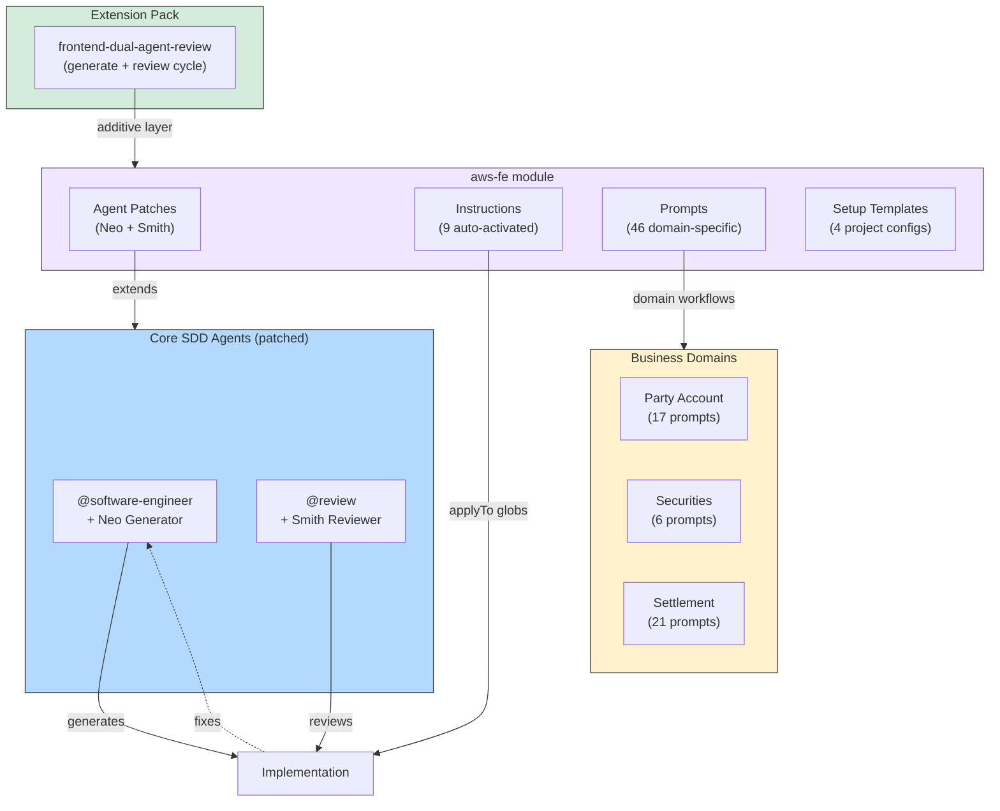

# PLAYBOOK — Acme FE Module

> Module-specific playbook for the **aws-fe** module.
> For the main Enterprise SDD playbook, see [PLAYBOOK.md](PLAYBOOK.md).

## Overview

The **aws-fe** module adds frontend workflows with prompts and guardrails for React, Redux Toolkit, and Stratos applications. It provides Acme FE-specific prompt workflows, reviewer/generator guidance, and the dual-agent review extension pack.

| | |
|---|---|
| **Tech Stack** | TypeScript 5.x, React, Vite, Redux Toolkit, Stratos UI |
| **Testing** | Vitest + mock API |
| **Provides** | 9 instructions, 2 agent patches, 46 prompts, 4 setup templates |

## Installation

```bash
sdd module install aws-fe
sdd module list                       # verify installation
```

## Agent Patches

| Agent Patch | Base Agent | What It Adds |
|-------------|-----------|--------------|
| `agent-neo-generator` | `@software-engineer` | Model/API contract alignment before UI coding, feature-folder isolation, hook extraction, strict Stratos component-choice rules, Redux for cross-feature state only |
| `agent-smith-reviewer` | `@review` | Severity-first review workflow, Acme FE-specific code review patterns, dual-agent generate+review cycle |

### Dual-Agent Workflow

The Neo/Smith pair implements a generate-then-review pattern:

1. **Neo** (`@software-engineer` + neo-generator patch) generates the implementation
2. **Smith** (`@review` + smith-reviewer patch) reviews with severity-first analysis
3. Findings feed back to Neo for fixes

## Instruction Reference

| Instruction | Pattern Coverage |
|-------------|-----------------|
| `architecture` | React 19.2.3 + TS 5.9.3 + Redux Toolkit 2.11.1 + Stratos architecture |
| `general-coding` | Frontend coding standards: naming, file structure, imports |
| `react` | React-specific patterns: hooks, component composition, rendering |
| `typescript` | TypeScript patterns: type safety, generics, utility types |
| `stratos` | Stratos design system: tokens, spacing, component patterns |
| `mock-api` | Mock API setup for development and testing |
| `advanced-search-form` | Advanced search form patterns: filters, validation, state management |
| `advanced-search-results` | Search results: pagination, display, status handling |
| `item-status-badge` | Status badge component patterns |

## Prompt Library (46 prompts)

The module provides 46 domain-specific prompts organized by business area. Use them with `sdd spell <prompt-name>`.

### General

| Prompt | Purpose |
|--------|---------|
| `nullable-migration` | Nullable fields migration guide for models |
| `scaffolding` | Application scaffolding using gear CLI |

### Party Account Domain (17 prompts)

| Prompt | Purpose |
|--------|---------|
| `context-selector` | Context selector component |
| `filters` | Party account filter patterns |
| `homepage` | Homepage layout and navigation |
| `party-account-list` | Party account list view |
| `party-creation` | Party creation workflow |
| `party-update` | Party update workflow |
| `closure-request` | Closure request initiation |
| `closure-modal` | Closure confirmation modal |
| `party-list-view` | Alternative party list patterns |
| `request-list` | Request list management |
| `4-eye-workflow` | Four-eye approval workflow |
| `csv-export` | CSV export functionality |
| `technical-address-creation` | Technical address creation |
| `technical-address-closure` | Technical address closure |
| *(+ 3 additional party prompts)* | |

### Securities Domain (6 prompts)

| Prompt | Purpose |
|--------|---------|
| `advanced-search` | Securities advanced search |
| `context-selector` | Securities context selector |
| `homepage` | Securities homepage |
| `instructions-search-filters` | Instructions search filter UI |
| `instructions-search-results` | Instructions search results display |
| `instrument-list` | Securities instrument list |

### Settlement Domain (21 prompts)

| Prompt | Purpose |
|--------|---------|
| `field-additions` | Add new fields to settlement forms |
| `field-migrations` | Migrate existing field definitions |
| `instructing-party-bic` | Instructing party BIC patterns |
| `amendment-workflow` | Settlement amendment workflows |
| `cancellation` | Cancellation request handling |
| `restriction-management` | Restriction management UI |
| `error-management` | Error display and recovery flows |
| `filter-patterns` | Settlement filter patterns |
| `dca-search` | DCA (Delivery vs Cash) search |
| `account-search` | Account search components |
| `transaction-id-header` | Transaction ID request headers |
| *(+ 10 additional settlement prompts)* | |

## Setup Templates

| Template | Purpose |
|----------|---------|
| `project-guidelines.setup.md` | Project guidelines and team conventions |
| `unit-tests.setup.md` | Unit testing setup and patterns |
| `vscode-mcp.setup.json` | VS Code MCP server configuration |
| `vscode-settings.setup.json` | VS Code workspace settings |

## Frontend Tailored Packs

### Available Packs

| Pack | Domain Category | Namespace | Purpose |
|------|----------------|-----------|---------|
| `sdd-extension-frontend-dual-agent-review` | review | `aws-fe` | Dual-agent generate+review workflow with Neo/Smith profiles |

### Installation

1. Install the aws-fe module (and std-fe if using stratos packs):
   ```bash
   sdd module install aws-fe
   sdd module install std-fe   # if using stratos packs too
   ```

2. Validate the dual-agent-review pack:
   ```bash
   sdd extension validate .sdd-extensions/extensions/frontend-dual-agent-review --format tailored
   ```

### Using Pack Prompts

```bash
sdd spell aws-fe-review-branch-diff    # Run dual-agent severity-first review
sdd spell aws-fe-generate-and-review   # Full generate + review cycle
```

## Helicopter View



## Recommended Scenarios

| Scenario | What to Install |
|----------|----------------|
| Frontend microfrontend (Acme FE stack) | `aws-fe` only |
| End-to-end product stream (backend + Acme FE FE) | `core-be` + `aws-fe` |
| Review-focused team | `std-fe` + `aws-fe` |
| Full multi-frontend workspace | All three modules |

### Composition Recipes

| Recipe | Packs | Modules Required | Recommended Execution Mode |
|--------|-------|------------------|---------------------------|
| Review-focused team | `frontend-stratos-core` + `frontend-dual-agent-review` | `std-fe` + `aws-fe` | `standard` |
| Full frontend stack | All packs | `std-fe` + `aws-fe` | `autonomous-guided` |

---

## FE Design Contract *(Wave 27 §26 #6)*

Every feature in `aws-fe` that requires UI design work uses a **two-spine contract** to seal the design→engineering handoff:

| Spine | Template | Role |
|-------|----------|---------|
| **DESIGN** | `.specify/templates/design-tokens-template.md` | Visual identity — named color, spacing, typography, motion, and elevation tokens |
| **EXPERIENCE** | `.specify/templates/experience-template.md` | Flows, states, IA, a11y — references design tokens via `{design-tokens.TOKEN}` syntax |

### Workflow

1. During Phase 2 (Design), copy both templates into the feature spec folder:
   ```bash
   cp .specify/templates/design-tokens-template.md .specify/specs/NNN/design-tokens.md
   cp .specify/templates/experience-template.md     .specify/specs/NNN/experience.md
   ```
2. Fill `design-tokens.md` first — define every named token.
3. Fill `experience.md`, referencing tokens as `{design-tokens.color.primary.default}` etc.
4. Run `sdd extension doctor <your-extension-path>` to check for unresolved `{design-tokens.*}` references. Unresolved references produce a **WARN**.
5. The Handoff Checklist in `experience-template.md` §8 must be complete before Gate 2.

> **Constraint #8:** The design-contract templates are scoped to `std-fe` and `aws-fe` only. The tech-agnostic SDD core is unchanged.
