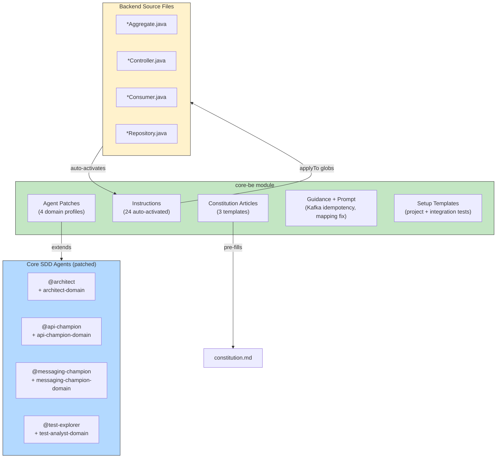

# PLAYBOOK — Core-BE Module

> Module-specific playbook for the **core-be** module.
> For the main Enterprise SDD playbook, see [PLAYBOOK.md](PLAYBOOK.md).

## Overview

The **core-be** module adds domain-driven backend patterns for Java 21, Quarkus, Kafka, and PostgreSQL microservices. Module instructions auto-activate via `applyTo` globs when you edit matching backend files.

| | |
|---|---|
| **Tech Stack** | Java 21, Quarkus, Kafka + Confluent Schema Registry, PostgreSQL, Maven |
| **Testing** | Cucumber + REST Assured + Testcontainers |
| **Provides** | 24 instructions, 4 agent patches, 1 guidance, 1 prompt, 3 constitution articles, 2 setup templates |

## Installation

```bash
sdd module install core-be
sdd module list                       # verify installation
```

## Agent Patches

Agent patches extend core SDD agents with domain-specific knowledge when the module is installed.

| Agent Patch | Base Agent | What It Adds |
|-------------|-----------|--------------|
| `api-champion-domain` | `@api-champion` | Multi-tenancy endpoint patterns (`/tenants/{tenant}/{project-domain}/`), API versioning (`/v1/`, `/v1alpha/`), resource hierarchy |
| `architect-domain` | `@architect` | DDD aggregate/entity boundaries, Quarkus service structure, PostgreSQL schema patterns |
| `messaging-champion-domain` | `@messaging-champion` | Kafka topic naming, Avro schema registry, consumer group patterns, dead-letter handling |
| `test-analyst-domain` | `@test-explorer` | Cucumber scenario conventions, Testcontainers setup, REST Assured assertion patterns |

## Instruction Reference

Instructions auto-activate based on `applyTo` glob patterns. When you edit a matching file, the instruction is automatically loaded as agent context.

### DDD Building Blocks

| Instruction | Pattern Coverage |
|-------------|-----------------|
| `aggregate` | Aggregate roots, consistency boundaries, invariant enforcement |
| `entity` | Entity definitions, identity, lifecycle |
| `valueobject` | Value objects, immutability, equality |
| `domainevent` | Domain event modeling, event naming, payload structure |
| `domainrepository` | Repository pattern: interfaces and contracts |
| `repositoryinterface` | Repository interface definitions |
| `repositoryimplementation` | Repository implementation with PostgreSQL |
| `usecase` | Use case / application service patterns |
| `statemachine` | State machine patterns for aggregate lifecycle |

### API & Controllers

| Instruction | Pattern Coverage |
|-------------|-----------------|
| `controller-quarkus` | Quarkus REST controller patterns, validation, error mapping |
| `mapper-domain` | Domain ↔ DTO mapping conventions |

### Messaging & Events

| Instruction | Pattern Coverage |
|-------------|-----------------|
| `kafka-consumer` | Kafka consumer implementation, offset management |
| `eventhandler` | Event handler binding, idempotency |
| `envelope` | Message envelope wrapping pattern |
| `enveloperepository` | Envelope persistence for outbox pattern |
| `database-envelope` | Database-level envelope storage |

### Query & Data

| Instruction | Pattern Coverage |
|-------------|-----------------|
| `queryhandler` | Query handler (read-side) patterns |
| `info` | Information/metadata endpoint conventions |

### Testing

| Instruction | Pattern Coverage |
|-------------|-----------------|
| `testing-java` | Java testing patterns: unit, integration, contract |
| `test-data-flow` | Test data flow for integration tests with Testcontainers |

## Constitution Articles

Pre-fill project constitution with technology commitments when creating a new project:

| Article | Content |
|---------|---------|
| `article-II-tech-stack` | Java 21, Quarkus, Maven, PostgreSQL, Kafka commitments |
| `article-III-patterns` | DDD aggregates, CQRS, event sourcing, outbox pattern |
| `article-IV-conventions` | Naming conventions, package structure, code style |

## Prompt & Guidance

| Type | Name | Purpose |
|------|------|---------|
| Prompt | `fix-mapping-issues` | Diagnose and fix domain ↔ DTO mapping issues |
| Guidance | `kafka-idempotency-quarkus` | Idempotent Kafka consumer patterns in Quarkus (pros, cons, examples) |

## Setup Templates

| Template | Purpose |
|----------|---------|
| `project.setup.md` | New Java/Quarkus project scaffolding |
| `integration-tests.setup.md` | Integration test environment with Testcontainers |

## Helicopter View



## Recommended Scenarios

| Scenario | What to Install |
|----------|----------------|
| Backend-only domain service | `core-be` only |
| End-to-end product stream (backend + Std-FE) | `core-be` + `std-fe` |
| End-to-end product stream (backend + Acme FE FE) | `core-be` + `aws-fe` |
| Full multi-frontend workspace | All three modules |
