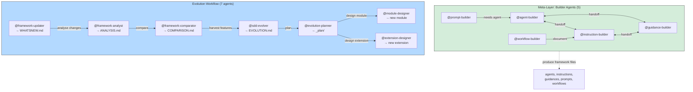

# PLAYBOOK — SDD Evolution Module

> Module-specific playbook for the **sdd-evolution** module.
> For the main Enterprise SDD playbook, see [PLAYBOOK.md](PLAYBOOK.md).

## Overview

The **sdd-evolution** module provides two capabilities:

1. **Framework Evolution** — Track public AI agent frameworks, analyse them, harvest features, and plan Enterprise SDD improvements.
2. **Meta Agents (Builders)** — Extend the framework itself by creating new agents, instructions, guidances, prompts, and workflows.

Install the module:

```bash
sdd module install sdd-evolution
```

---

## Meta Agents — Extending the Framework

The **meta-layer** consists of 5 **builder agents** that extend the framework itself. They are **workflow-independent** — they don't participate in the Phase 0–5 pipeline. Use them when you need to create new agents, instruction files, guidance documents, prompt templates, or CI/CD workflows.

All builder agents follow the same pattern: **interactive consultation** → **structured output**. They ask targeted questions, validate answers, and produce files that follow SDD conventions.

| Builder | Purpose | Output |
|---------|---------|--------|
| `@agent-builder` | Create new agents or improve existing ones | `.agent.md` file following SDD conventions |
| `@instruction-builder` | Create shared instruction files | `.instructions.md` file with `applyTo` pattern |
| `@guidance-builder` | Create guidance documents | `.guidance.md` file with pros/cons/examples |
| `@prompt-builder` | Create prompt templates | `.prompt.md` file composing agent chains |
| `@workflow-builder` | Create CI/CD workflow files | `.yml` GitHub Actions workflow |

### When to use

| I want to... | Use |
|--------------|-----|
| Add a new agent to the workflow | `@agent-builder` |
| Standardize a coding pattern across files | `@instruction-builder` |
| Document a best practice with trade-offs | `@guidance-builder` |
| Create a reusable prompt for a common scenario | `@prompt-builder` |
| Automate a quality check in CI/CD | `@workflow-builder` |
| Improve an existing agent | `@agent-builder` (improvement mode) |

### How they collaborate

The builder agents form a **self-referencing network** — each can hand off to the others:

```
@agent-builder
    ├──▶ @instruction-builder (create instruction for the new agent)
    └──▶ @guidance-builder (create guidance document)

@instruction-builder
    ├──▶ @agent-builder (create agent that uses the instruction)
    └──▶ @guidance-builder (create companion guidance)

@guidance-builder
    ├──▶ @instruction-builder (create enforceable rules from guidance)
    └──▶ @agent-builder (create agent that applies the guidance)

@prompt-builder
    ├──▶ @agent-builder (create agent needed by the prompt)
    └──▶ @instruction-builder (create instruction for the prompt)

@workflow-builder
    ├──▶ @instruction-builder (document CI/CD conventions)
    └──▶ @guidance-builder (explain CI/CD strategy)
```

### Step-by-step example: Using the builders

This example shows the full builder workflow — creating an instruction, then a guidance, then wiring them into an agent.

#### 1. Create a shared instruction with `@instruction-builder`

```
@instruction-builder I need an instruction file for our NestJS controller pattern.
It should apply to all files matching src/**/*Controller.ts.
```

**What happens**: The builder asks targeted questions in phases:
1. **Scope Discovery** — "What pattern are you standardizing? What glob?" → You answer
2. **Content Gathering** — For each section (Overview, Core Principles, Requirements, Patterns, Validation, Anti-Patterns), the builder asks probing questions and challenges vague answers
3. **Validation** — Presents a summary and asks "Does this capture your standards?"
4. **File Creation** — Creates `.github/instructions/controller.instructions.md`
5. **Integration** — Suggests which agents should reference it

**Output**: `.github/instructions/controller.instructions.md` with `applyTo: "src/**/*Controller.ts"`

#### 2. Create companion guidance with `@guidance-builder`

```
@guidance-builder Create a guidance document explaining the rationale behind our 
NestJS controller patterns — why we chose this approach, trade-offs, and alternatives.
```

**What happens**: The builder asks for each of the 8 mandatory sections:
1. **Topic Discovery** — "What is the guidance about? Who is the audience?"
2. **Content Gathering** — Description, Motivation, Scenarios, Pros, Cons, Usage Example, Conclusion
3. The builder **challenges you** if you say "no cons" — every practice has trade-offs
4. **Validation** — Reviews completeness of all sections
5. **File Creation** — Creates `.github/guidances/nestjs-controller-pattern.guidance.md`

**Output**: `.github/guidances/nestjs-controller-pattern.guidance.md`

#### 3. Create an agent that uses them with `@agent-builder`

```
@agent-builder Create a Controller Reviewer agent that reviews NestJS controllers 
for compliance with our patterns. It should reference the controller instruction 
and guidance we just created.
```

**What happens**: The builder walks through 5 phases:
1. **Discovery** — Role, Phase, Purpose, Users, Scope, Artifacts
2. **Persona Design** — Identity, Tone, Key behaviors
3. **Tool Selection** — Minimal sufficient toolset (challenges "just in case" tools)
4. **Instruction & Handoff Design** — References `controller.instructions.md`, defines handoffs
5. **Boundaries & Self-Assessment** — Always Do / Ask First / Never Do, checklist

**Output**: `.github/agents/controller-reviewer.agent.md`

#### 4. Create a prompt template with `@prompt-builder`

```
@prompt-builder Create a prompt for reviewing all controllers in a project. 
It should invoke the controller-reviewer agent and then the review agent.
```

**What happens**: The builder:
1. Verifies agents exist in the registry
2. Checks for overlap with existing prompts
3. Defines steps in SDD phase order
4. Creates `.github/prompts/review-controllers.prompt.md`

#### 5. Create a CI/CD workflow with `@workflow-builder`

```
@workflow-builder Create a workflow that lints controller files on PRs 
that modify src/**/*Controller.ts
```

**What happens**: The builder:
1. Checks for overlap with existing workflows
2. Designs trigger paths and permissions (least-privilege)
3. Creates validation logic with Step Summary output
4. Creates `.github/workflows/controller-lint.yml`

### SDD conventions enforced by Agent Builder

Every agent created by `@agent-builder` must include:

1. **Constitution reference** — reads constitution via shared instruction
2. **Phase assignment** — belongs to a named phase (0–5, pre-0, 5b, maintenance, meta)
3. **Boundary rules** — Always Do / Ask First / Never Do sections
4. **Shared instructions** — references appropriate `.instructions.md` files
5. **Traceability** — produces artifacts with traceable IDs (if applicable)
6. **`send: false`** — all handoffs use `send: false` (human-in-the-loop)
7. **Self-assessment checklist** — agent verifies its own output before declaring completion

---

## Evolution Workflow

The evolution workflow tracks public AI agent frameworks and proposes improvements to Enterprise SDD:

```
1. Update repos        →  @framework-updater pulls latest, updates WHATSNEW.md
2. Analyse frameworks  →  @framework-analyst produces *-ANALYSIS.md per framework
3. Compare frameworks  →  @framework-comparator produces COMPARISON.md
4. Harvest features    →  @sdd-evolver proposes improvements in EVOLUTION.md
5. Plan implementation →  @evolution-planner creates phased task plan in _plan/
6. Design new modules  →  @module-designer scaffolds new SDD modules
7. Design extensions   →  @extension-designer scaffolds new SDD extensions
```

### Module Agents

| Agent | Purpose | Model Tier |
|-------|---------|------------|
| `@framework-analyst` | Analyse a single framework → produce ANALYSIS.md | deep |
| `@framework-comparator` | Compare multiple frameworks → produce COMPARISON.md | deep |
| `@framework-updater` | Pull latest repos, detect changes, update WHATSNEW.md | standard |
| `@sdd-evolver` | Harvest features → propose improvements in EVOLUTION.md | deep |
| `@evolution-planner` | Convert proposals → actionable implementation plans | standard |
| `@module-designer` | Interactive design & scaffolding of new SDD modules | standard |
| `@extension-designer` | Interactive design & scaffolding of new SDD extensions | standard |
| `@agent-builder` | Create new `.agent.md` files or improve existing agents | standard |
| `@instruction-builder` | Create shared `.instructions.md` files | standard |
| `@guidance-builder` | Create `.guidance.md` documents | standard |
| `@prompt-builder` | Create `.prompt.md` templates | light |
| `@workflow-builder` | Create `.yml` GitHub Actions workflows | light |

For detailed information on module components (instructions, prompts, templates, scaffolds), see the [module README](.sdd-modules/modules/sdd-evolution/README.md).

## Helicopter View


