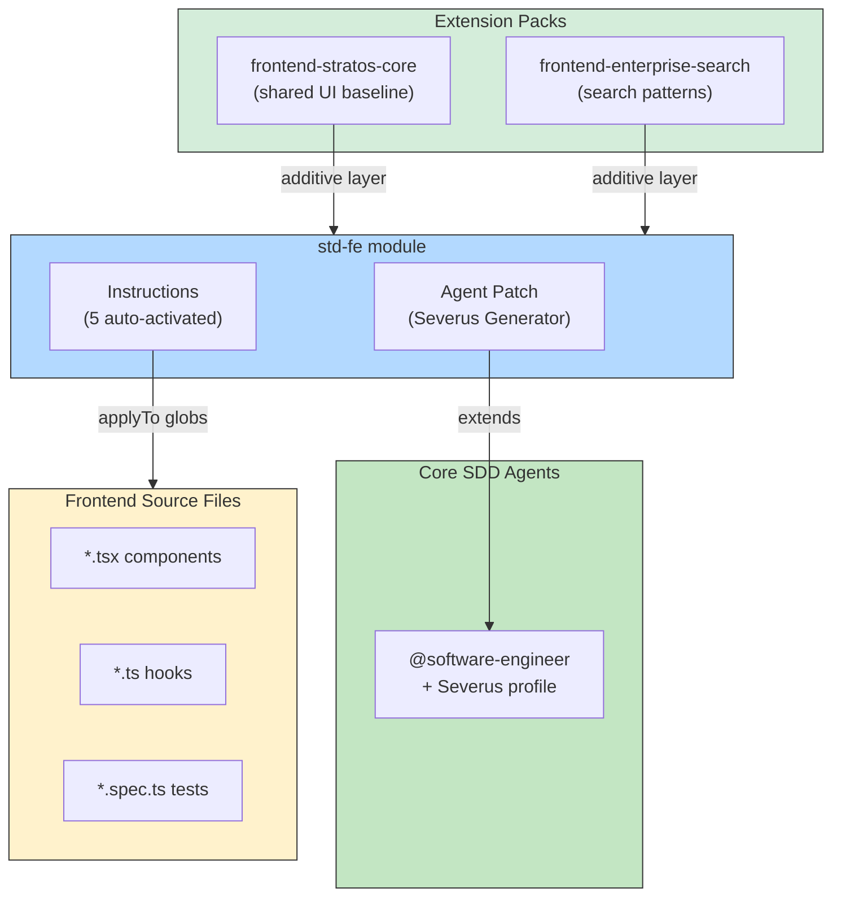

# PLAYBOOK — Std-FE Module

> Module-specific playbook for the **std-fe** module.
> For the main Enterprise SDD playbook, see [PLAYBOOK.md](PLAYBOOK.md).

## Overview

The **std-fe** module adds frontend microfrontend implementation patterns for React 19, Vite, and Stratos. Module instructions auto-activate via `applyTo` globs when you edit matching frontend files.

| | |
|---|---|
| **Tech Stack** | TypeScript 5.x, React 19, Vite, Stratos UI |
| **Testing** | Vitest + Playwright + Cucumber |
| **Provides** | 5 instructions, 1 agent patch, 1 setup template |

## Installation

```bash
sdd module install std-fe
sdd module list                       # verify installation
```

## Agent Patch

| Agent Patch | Base Agent | What It Adds |
|-------------|-----------|--------------|
| `agent-severus-generator` | `@software-engineer` | Feature-isolated React/TS structures, hook extraction, Stratos conventions with tokenized spacing, E2E coverage requirements |

The Severus Generator profile activates when the module is installed, ensuring `@software-engineer` follows frontend-specific patterns during implementation.

## Instruction Reference

| Instruction | Pattern Coverage |
|-------------|-----------------|
| `architecture` | React 19.2.0 + Vite 6.2.5 + TS 5.7.3 micro-frontend architecture (Module Federation) |
| `e2e-testing` | End-to-end testing patterns with Playwright + Cucumber |
| `general-coding` | Frontend coding standards: naming, file structure, imports |
| `stratos-ui-agent` | Stratos UI component agent behavior: when to use which component |
| `stratos` | Stratos design system: tokens, spacing, component patterns |

## Frontend Tailored Packs

Enterprise SDD includes specialized extension packs for frontend teams building React/Stratos microfrontends. Packs are additive layers on top of the std-fe module and the core extension framework.

### Available Packs

| Pack | Domain Category | Namespace | Purpose |
|------|----------------|-----------|---------|
| `sdd-extension-frontend-stratos-core` | stratos | `fe` | Shared UI baseline: design tokens, MFE architecture, component ambiguity, state decisions |
| `sdd-extension-frontend-enterprise-search` | search | `fe` | Advanced search form pattern, results pagination, status badge |

### Composition Recipes

| Recipe | Packs | Recommended Execution Mode |
|--------|-------|---------------------------|
| React product app | `frontend-stratos-core` | `standard` |
| Search-heavy app | `frontend-stratos-core` + `frontend-enterprise-search` | `standard` or `autonomous-guided` |
| Full frontend stack | All packs (+ aws-fe dual-agent-review) | `autonomous-guided` |

### Installation Order

1. Install the std-fe module first:
   ```bash
   sdd module install std-fe
   ```

2. Validate and install the base pack:
   ```bash
   sdd extension validate .sdd-extensions/extensions/frontend-stratos-core --format tailored
   sdd extension resolve-conflicts .sdd-extensions/extensions/frontend-stratos-core --dry-run
   ```

3. Stack additional packs as needed:
   ```bash
   sdd extension validate .sdd-extensions/extensions/frontend-enterprise-search --format tailored
   ```

4. Verify no conflicts with the doctor:
   ```bash
   sdd extension doctor .sdd-extensions/extensions/frontend-stratos-core
   sdd extension doctor .sdd-extensions/extensions/frontend-enterprise-search
   ```

### Using Pack Prompts

```bash
sdd spell fe-scaffold-component       # Scaffold a Stratos component
sdd spell fe-design-review            # Review for Stratos compliance
sdd spell fe-scaffold-search-feature  # Scaffold a complete search feature
```

## Helicopter View



## Execution Mode Guidance

- Use `standard` mode for new features where requirements are ambiguous
- Use `autonomous-guided` for well-defined search features with clear field specifications
- The component ambiguity resolution protocol will force stops regardless of mode
- State decisions for global/feature-scoped state must be documented before implementation proceeds

## Recommended Scenarios

| Scenario | What to Install |
|----------|----------------|
| Frontend microfrontend (Convergence stack) | `std-fe` only |
| End-to-end product stream (backend + FE) | `core-be` + `std-fe` |
| Full multi-frontend workspace | All three modules |

---

## FE Design Contract *(Wave 27 §26 #6)*

Every feature in `std-fe` that requires UI design work uses a **two-spine contract** to seal the design→engineering handoff:

| Spine | Template | Role |
|-------|----------|---------|
| **DESIGN** | `.specify/templates/design-tokens-template.md` | Visual identity — named color, spacing, typography, motion, and elevation tokens |
| **EXPERIENCE** | `.specify/templates/experience-template.md` | Flows, states, IA, a11y — references design tokens via `{design-tokens.TOKEN}` syntax |

### Workflow

1. During Phase 2 (Design), copy both templates into the feature spec folder:
   ```bash
   cp .specify/templates/design-tokens-template.md .specify/specs/NNN/design-tokens.md
   cp .specify/templates/experience-template.md     .specify/specs/NNN/experience.md
   ```
2. Fill `design-tokens.md` first — define every named token.
3. Fill `experience.md`, referencing tokens as `{design-tokens.color.primary.default}` etc.
4. Run `sdd extension doctor <your-extension-path>` to check for unresolved `{design-tokens.*}` references. Unresolved references produce a **WARN**.
5. The Handoff Checklist in `experience-template.md` §8 must be complete before Gate 2.

> **Constraint #8:** The design-contract templates are scoped to `std-fe` and `aws-fe` only. The tech-agnostic SDD core is unchanged.
