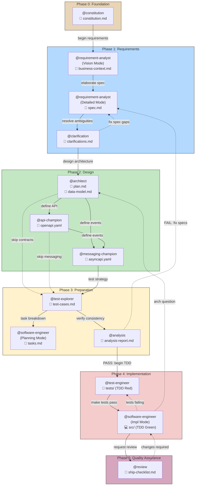
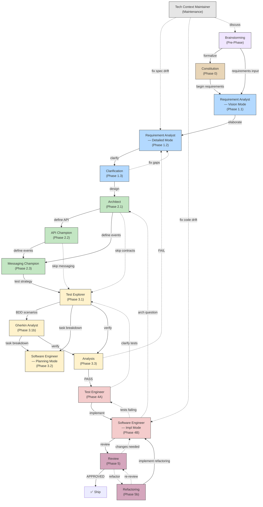
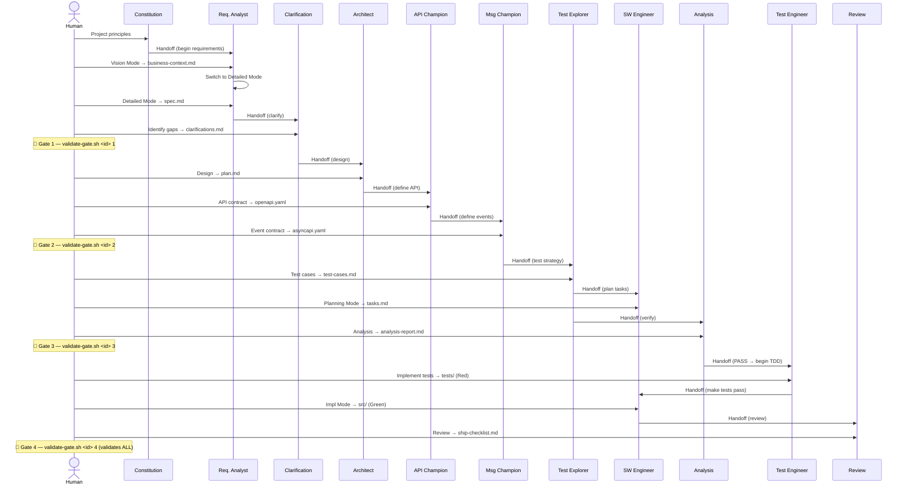

# Playbook: Enterprise SDD Workflow

> **Version**: 4.7
> **Date**: April 26, 2026
> **Audience**: anyone who wants to test the workflow — no prior knowledge required.

---

## Table of Contents

**Getting Started**
1. [What is this project](#what-is-this-project)
2. [Prerequisites](#prerequisites)
3. [Initial Setup](#initial-setup)

**Process (Phases 0–5)**
4. [Execution Modes — Standard vs. Autonomous](#execution-modes--standard-vs-autonomous)
5. [Create a Feature](#create-a-feature)
6. [Pre-Phase — Brainstorming](#pre-phase--brainstorming-optional)
7. [Set Project Rules](#set-project-rules)
8. [Write Requirements](#write-requirements)
9. [Design the Solution](#design-the-solution)
10. [Prepare Tests and Tasks](#prepare-tests-and-tasks)
11. [Implement the Feature](#implement-the-feature)
12. [Review and Ship](#review-and-ship)
13. [Visual Summary](#visual-summary)

**CLI & Tooling**
14. [CLI Usage](#cli-usage)
15. [Support Commands](#support-commands)

**Reference**
16. [Context Window Discipline](#context-window-discipline)
17. [Recommended Model Tiers](#recommended-model-tiers)
18. [Agent → Artifact → Gate Map](#agent--artifact--gate-map)
19. [Tool Access Matrix](#tool-access-matrix)
20. [Agent Handoff Chain](#agent-handoff-chain)
21. [Prompt Library](#prompt-library)

**Extensibility**
22. [How Instruction Files Work](#how-instruction-files-work)
23. [Meta Agents — Extending the Framework](#meta-agents--extending-the-framework)
24. [User Modules](#user-modules)
25. [Extensions and Presets](#extensions-and-presets)
26. [CI/CD — Automated Workflows](#cicd--automated-workflows)

**Configuration**
27. [Team Preferences](#team-preferences)
28. [TDD Mode](#tdd-mode)
29. [Multi-IDE Adapters](#multi-ide-adapters)
30. [Issue Sync](#issue-sync)

**Appendix**
31. [Troubleshooting](#troubleshooting)
32. [Cleanup After Testing](#cleanup-after-testing)
33. [Glossary](#glossary)
34. [Development History](#development-history)

---

## Quick-Start Workflow Map

> One-page visual overview of the Enterprise SDD pipeline. Start here if you are a new operator.

```
┌─────────────────────────────────────────────────────────────────────┐
│                     SDD Quick-Start Workflow Map                    │
├────────────────┬────────────────┬─────────────────┬─────────────────┤
│  1. SPECIFY    │  2. DESIGN     │  3. PREPARE     │  4. IMPLEMENT   │
│                │                │                 │   & SHIP        │
│ Constitution   │ Architecture   │ Test cases      │ TDD Red/Green   │
│ Spec + Scope   │ + Contracts    │ Tasks + Report  │ Review + Gate   │
│                │                │                 │                 │
│ Agents:        │ Agents:        │ Agents:         │ Agents:         │
│ @constitution  │ @architect     │ @test-explorer  │ @test-engineer  │
│ @requirement-  │ @api-champion  │ @gherkin-analyst│ @software-      │
│   analyst      │ @messaging-    │ @software-      │   engineer      │
│ @clarification │   champion     │   engineer      │ @review         │
│                │                │ @analysis       │ @refactoring    │
│                │                │                 │                 │
│  Gate 1 ─────► │  Gate 2 ─────► │  Gate 3 ─────►  │  Gate 4 ─────►  │
│  (Spec OK)     │  (Design OK)   │  (Prep OK)      │  (Ship OK)      │
└────────────────┴────────────────┴─────────────────┴─────────────────┘

Commands:  sdd new → sdd gate 1 → sdd gate 2 → sdd gate 3 → sdd gate 4 → sdd ship
Memory:    sdd memory status → execute → sdd memory sync → gate
Skills:    sdd skill run sdd-auto-implement | sdd-challenge
Modes:     standard (default) | autonomous-guided | autonomous-governed
Packs:     sdd extension validate → sdd extension doctor (see §28 Frontend Tailored Packs)
Modules:   sdd module list → sdd module install (see .sdd-modules/README.md for bundles)
```

---

## What is this project

Enterprise SDD Workflow is a **spec-driven** software development system (Spec-Driven Development). The concept is simple: first you write all the specs (requirements, design, tests), then you implement the code.

The system provides:

- **16 core AI agents**, each responsible for a specific step (13 pipeline + 3 auxiliary), plus 12 additional agents via the **sdd-evolution** module
- **32 prompt files** for common workflow scenarios — including `retrospective.prompt.md` for post-feature learning loops, `convergence-review.prompt.md` for multi-model review orchestration, `release-triad-synthesis.prompt.md` for Gate 4 triad decision synthesis, `checkpoint-preview.prompt.md` for concern-ordered ship-time review, `context-debt-audit.prompt.md` for instruction/skill hygiene audits, and `adoption-business-case.prompt.md` for TCO + ROI analysis
- **23 shared instruction files** that standardize cross-cutting concerns (traceability IDs, structured question format, constitution reading procedure, API design patterns, messaging design patterns, AI anti-pattern enforcement, anti-pattern code examples, adaptive ceremony levels, structured memory protocol, context bridge protocol, stuck detection, cost tracking, autonomy policy, TDD enforcement, prompt injection scanning, agent design principles, agent lint checks, progressive planning, escalation protocol, convergence review, gate hooks, skill authoring standards, source verification workflow) across all agents
- **Curated skills and local skill descriptors** to support challenge, auto-implementation, traceability audit, extension safety, memory operating loops, security scanning (malicious code detection, supply chain risk, secrets scan), agent lint (IN-01 through IN-08), ambiguity scoring, document generation (docx/xlsx/pptx), document ingestion, adversarial spec analysis (red-team-spec), source citation auditing, and Jira REST fallback operations
- **4 quality gates** that automatically verify that artifacts are complete and consistent
- **Python CLI + Bash/PowerShell automation suite** to manage features, validate gates, analyze consistency, generate context bridges, adapters, modules, presets, issue sync, memory flows, worktrees, and resume from checkpoints
- **Structured memory + context bridges** to keep long-running feature work restartable and auditable
- **Modules, extensions, and presets** as additive layers for stack knowledge and workflow customization
- **3 custom MCP servers** to manage spec context

The agents run inside **VS Code** through **GitHub Copilot Chat**. The user opens the chat, types `@agent-name` followed by a prompt, and the agent generates a structured document (an "artifact") in the required format.

### How to use this playbook

This guide is intentionally complete. For a first run, execute only this minimal path:

1. Initial Setup
2. Create a Feature
3. Set Project Rules
4. Write Requirements
5. Design the Solution
6. Prepare Tests and Tasks
7. Implement the Feature
8. Review and Ship

Use the remaining sections as reference when you need deeper guidance.

---

## Prerequisites

### Software that must already be installed

| Software | Minimum Version | How to verify | How to install |
|----------|----------------|---------------|----------------|
| **VS Code** | Latest stable | Open VS Code → Help → About | [code.visualstudio.com](https://code.visualstudio.com) |
| **GitHub Copilot** (VS Code extension) | Latest | VS Code → Extensions → search "GitHub Copilot" → should show "Installed" | In the Extensions bar, search "GitHub Copilot" → Install. An active subscription is required. |
| **GitHub Copilot Chat** (VS Code extension) | Latest | VS Code → Extensions → search "GitHub Copilot Chat" → should show "Installed" | Same procedure as Copilot |
| **Python** | ≥ 3.11 | Open the terminal and type: `python3 --version` (or `py --version` on Windows) | [python.org](https://www.python.org/downloads/) |
| **Git** | Any | `git --version` | [git-scm.com](https://git-scm.com) |
| **Bash shell** | Any | `bash --version` | **macOS/Linux:** built-in. **Windows:** not required for CLI usage (the CLI dispatches `.ps1` natively via PowerShell). Only needed if running `.sh` scripts directly — install [Git for Windows](https://gitforwindows.org) or use [WSL](https://learn.microsoft.com/en-us/windows/wsl/install). |

> **Windows users:** The `sdd` CLI works natively with PowerShell — no Bash installation needed. All `.sh` scripts have `.ps1` counterparts and the CLI dispatches to the correct one automatically. If you want to run `.sh` scripts directly, install [Git for Windows](https://gitforwindows.org) and configure VS Code to use Git Bash as the integrated terminal: Settings → search "terminal.integrated.defaultProfile.windows" → select "Git Bash".

### What is GitHub Copilot Chat

GitHub Copilot Chat is a panel inside VS Code where you can chat with the AI. To open it:

- **Mac**: `Cmd+Shift+I` (or click the chat icon in the left sidebar)
- **Windows/Linux**: `Ctrl+Shift+I`

Once open, you can type free text. To use a specific agent, type `@` followed by the agent name (e.g. `@constitution`).

### What is an "agent"

An agent is an AI assistant specialized in a specific task. In this project there are 15 core agents, each with a defined role (requirements analyst, architect, test engineer, etc.). Additional agents are provided by modules (e.g., the sdd-evolution module adds 12 more). Each agent has internal instructions that tell it how to behave, which files to read, and what format to give the output.

### What is a "gate"

A gate (quality gate) is an automated validation checkpoint. Before proceeding to the next phase, a script is run that verifies all required artifacts are present, properly filled in (no longer empty templates), and consistent with each other. If the gate fails, the script indicates exactly what is missing.

---

## Initial Setup

If you are installing Enterprise SDD into a different repository (greenfield or existing codebase), start with [INSTALL-IN-NEW-PROJECT.md](INSTALL-IN-NEW-PROJECT.md) and then return to this playbook for day-to-day execution.

These steps need to be performed **only once**, before the first test.

### Step 1: Open the project in VS Code

1. Open VS Code
2. Menu File → Open Folder
3. Navigate to the project root folder and select it
4. Click "Open"

### Step 2: Open the integrated terminal

1. Menu Terminal → New Terminal (or shortcut: `Ctrl+\`` on Windows/Linux, `Cmd+\`` on macOS)
2. The terminal opens at the bottom of VS Code
3. Verify that the prompt shows the path to the project root

### Step 3: Make scripts executable and initialize

Type in the terminal:

```bash
chmod +x .specify/scripts/*.sh
./.specify/scripts/init.sh
```

**What it does**: `chmod +x` makes the scripts executable (needed the first time). `init.sh` creates the necessary directories (`.specify/memory/`, `.specify/specs/`, `.specify/stuck-history/`, etc.) and initializes the 5 structured memory files (`session-state.md`, `decisions.md`, `lessons.md`, `research-cache.md`, `metrics-log.md`) if they don't already exist.

**Expected output**: a green message saying "Initialization complete!" with the directory structure.

### Step 4: Verify that agents are visible

1. Open Copilot Chat (`Cmd+Shift+I` on Mac)
2. In the text box, type the `@` character
3. A dropdown menu should appear with at least these 15 core agents:
   - `brainstorming`
   - `constitution`
   - `requirement-analyst`
   - `clarification`
   - `architect`
   - `api-champion`
   - `messaging-champion`
   - `test-explorer`
   - `gherkin-analyst`
   - `analysis`
   - `test-engineer`
   - `software-engineer`
   - `review`
   - `refactoring`
   - `tech-context-maintainer`

> **Note**: Meta-builder agents (`agent-builder`, `instruction-builder`, `guidance-builder`, `prompt-builder`, `workflow-builder`) are available after installing the sdd-evolution module.

**If they don't appear**: verify that the `.github/agents/` folder contains 15 `.agent.md` files. Verify that `.vscode/settings.json` contains the line `"github.copilot.chat.agentsFolder": ".github/agents"`.

### Step 5 (optional): Configure environment variables

Only if you want to use the optional MCP servers (Confluence, Jira):

```bash
cp .env.example .env
```

Then open the `.env` file and enter your credentials. The optional MCP servers only work with valid credentials.

### Step 6 (optional): Install MCP server dependencies

Only if you want to use the custom MCP servers:

```bash
pip install -r mcp-servers/requirements.txt
```

### Getting Started on an Existing Project

If you're adding SDD to a project that already has code:

1. Run `sdd init` to create the `.specify/` directory structure
2. Run `@constitution` to define your project's constitution
3. Run `@tech-context-maintainer start` with the **strongest model** (Opus)
   - This generates `docs/technical/` from your existing codebase
   - It's a one-time investment; incremental updates are fast
4. Proceed with `sdd new "feature name"` for your first feature
5. The Architect and all subsequent agents will automatically read `docs/technical/`

> **Skip step 3** if the project is brand new with no existing code.

---

## Execution Modes — Standard vs. Autonomous

Enterprise SDD supports three execution modes that control how much autonomy the AI agents have during the feature lifecycle. The core lifecycle (phases, gates, agents) is the same in all modes — what changes is **who drives the loop**.

### Mode Overview

| Mode | Human Review | Guard-rails | Use Case |
|------|-------------|-------------|----------|
| **standard** | Every step | Full gates | Default — human drives each phase |
| **autonomous-guided** | After each cycle | Full gates + provenance | AI executes one item per cycle, human approves before next |
| **autonomous-governed** | At gates only | Full gates + provenance + constitution | AI chains cycles, human reviews at gate boundaries |

### Standard Mode — Human-Driven (default)

In standard mode **you drive every step**. You invoke each agent explicitly, review its output, and decide when to move to the next phase. This is the default and recommended starting point.

**Typical session:**

```
# 1. Create the feature
sdd new user-authentication

# 2. Phase 0 — Define project rules
@constitution Establish principles for a NestJS app with PostgreSQL...

# 3. Phase 1 — Write requirements
@requirement-analyst I need a user authentication feature with email/password login,
JWT tokens, and password reset via email.
    ↳ Review spec.md, ask questions, iterate
@clarification Are there rate-limiting requirements for login attempts?
    ↳ Review clarifications.md

# 4. Gate 1
sdd gate check 1 -f user-authentication
    ↳ Fix any failures, re-run until green

# 5. Phase 2 — Design
@architect Design the authentication service
    ↳ Review plan.md, challenge decisions, iterate
@api-champion Design the REST API for auth endpoints
    ↳ Review openapi.yaml

# 6. Gate 2
sdd gate check 2 -f user-authentication

# 7. Phase 3 — Test design
@test-explorer Define test strategy
@gherkin-analyst Write BDD scenarios

# 8. Phase 4 — Implementation
@software-engineer Plan tasks from the design
    ↳ Review tasks.md
@software-engineer Implement task T001
    ↳ Review code, discuss, iterate
@test-engineer Write unit tests for the auth service
    ↳ Review tests, run them

# 9. Gate 3
sdd gate check 3 -f user-authentication

# 10. Phase 5 — Ship
@review Run the final quality review
sdd gate check 4 -f user-authentication
```

**Key characteristic:** You are in the loop at every step. You read every artifact, challenge every decision, and approve before moving on. This gives maximum control and is ideal for learning SDD, complex features, or high-risk work.

### Autonomous-Guided Mode — AI Executes, You Approve

In autonomous-guided mode, the AI executes **one task at a time** from `tasks.md`, writes evidence, then **stops and waits for your approval** before proceeding.

**Typical session:**

```
# 1. Create feature with autonomous mode and a cycle budget
sdd new user-authentication --execution-mode autonomous-guided --autonomy-budget 10

# 2. Phases 0–2 in STANDARD mode (recommended)
#    Requirements and design are too important for unsupervised execution.
#    Use the normal @agent workflow described above.
@constitution ...
@requirement-analyst ...
@architect ...
sdd gate check 1 -f user-authentication
sdd gate check 2 -f user-authentication

# 3. Switch to autonomous for Phase 4 (implementation)
#    The AI picks task T001, implements it, runs tests, writes evidence, and stops.
#    Open a NEW chat session and run the autonomous-implement prompt:
> Use autonomous-implement for feature user-authentication

#    AI output:
#    ⏸️ Cycle 1 complete. Requesting operator approval.
#    Completed: T001 — Create User entity and repository
#    Confidence: 4/5
#    Next Item: T002 — Implement JWT token service

# 4. YOU review the evidence in todo.md, check the code, then approve
#    Open a NEW chat session (fresh context!) and run again:
> Use autonomous-implement for feature user-authentication

#    AI output:
#    ⏸️ Cycle 2 complete. Requesting operator approval.
#    Completed: T002 — Implement JWT token service
#    Confidence: 5/5
#    Next Item: T003 — Create login endpoint

# 5. Repeat until all tasks are done or budget is exhausted
# 6. Run Gate 3 and Phase 5 normally
sdd gate check 3 -f user-authentication
@review Run the final quality review
sdd gate check 4 -f user-authentication
```

**Key characteristic:** You skip the per-line code review during implementation but still approve each task. Each cycle runs in a **fresh chat session** to prevent context rot. Evidence is written to `todo.md` for auditability.

### Autonomous-Governed Mode — AI Chains Cycles

In autonomous-governed mode, the AI chains multiple cycles without per-step approval. You review at **gate boundaries only**.

**Typical session:**

```
# 1. Create feature with governed mode
sdd new user-authentication --execution-mode autonomous-governed --autonomy-budget 20

# 2. Phases 0–2 in STANDARD mode (always recommended for spec/design)
@constitution ...
@requirement-analyst ...
@architect ...
sdd gate check 1 -f user-authentication
sdd gate check 2 -f user-authentication

# 3. Let the AI implement all tasks autonomously
#    Each cycle: pick task → implement → test → write evidence → stop → new session
#    The AI decides when to proceed vs. escalate based on confidence and risk.

# 4. Monitor progress at any time
sdd autonomy status user-authentication
sdd status user-authentication --autonomy

# 5. The AI stops automatically when:
#    - All tasks are completed
#    - Budget is exhausted (20 cycles)
#    - An escalation trigger fires (blocker, low confidence, test failures)
#    - A gate boundary is reached

# 6. Review the evidence ledger and run gates
sdd gate check 3 -f user-authentication
@review Run the final quality review
sdd gate check 4 -f user-authentication
```

**Key characteristic:** Maximum speed for well-understood, repetitive features. The AI self-governs within the budget and escalation policy. If anything goes wrong, it stops and falls back to standard mode automatically.

### When to Use Each Mode

| Situation | Recommended Mode | Why |
|-----------|------------------|-----|
| First time using SDD | `standard` | Learn the workflow, understand each agent's output |
| Complex or ambiguous requirements | `standard` | Human judgment needed for spec/design decisions |
| High-risk or security-sensitive feature | `standard` | Every change needs human review |
| Well-understood CRUD feature | `autonomous-guided` | AI implements, you verify per-task |
| Batch of similar features (e.g., 5 REST endpoints) | `autonomous-governed` | AI chains implementation cycles |
| Unfamiliar domain or technology | `standard` | Human needs to learn alongside the AI |
| Bug fix with clear reproduction steps | `autonomous-guided` | AI fixes, you verify |
| Large refactoring with many small changes | `autonomous-governed` | Repetitive work, well-defined scope |

> **Rule of thumb:** Use `standard` for Phases 0–2 (requirements + design) regardless of mode. Autonomous modes shine in Phase 4 (implementation) where tasks are well-defined and verifiable.

### How It Works (Runtime Protocol)

1. **One item per cycle**: The AI agent picks exactly one task/story, implements it, writes evidence, then stops.
2. **Fresh context per cycle**: Each cycle starts from a clean context reading persistent files, preventing context rot.
3. **File-first persistence**: All state, evidence, and decisions live in files — never in chat memory.
4. **Constitution supremacy**: The autonomy policy in `.github/instructions/autonomy-policy.instructions.md` cannot be overridden.

### Setting Up Autonomous Execution

```bash
# Create feature with autonomous-guided mode and 10 cycle budget
sdd new my-feature --execution-mode autonomous-guided --autonomy-budget 10

# Check autonomy status at any time
sdd autonomy status my-feature
```

This writes the execution mode and budget into `.feature-meta.json`. The autonomous-implement prompt in `.github/prompts/autonomous-implement.prompt.md` reads this metadata to govern its behaviour.

### Autonomy Evidence & Diagnostics

For non-standard modes, Enterprise SDD materializes a per-cycle evidence pack and a derived progress ledger for auditability.

| Artifact | Path | Content |
|----------|------|---------|
| Evidence root | `.specify/checkpoints/autonomy-runs/<feature-id>/cycle-<NNN>/` | Per-cycle directory |
| Prompt snapshot | `cycle-<NNN>/prompt.md` | Exact prompt sent to the AI |
| Cycle result | `cycle-<NNN>/result.md` | Captured output block |
| Verifier verdict | `cycle-<NNN>/verdict.json` | Structured pass/retry/blocked with confidence |
| Progress ledger | `<feature-dir>/autonomy-progress.md` | Derived from all recorded cycles |

Structured verdict schema (minimum contract):

- `status`: `passed` | `retry` | `blocked`
- `confidence`: numeric score normalized to 0.0–1.0
- `repair_hint`: actionable hint for retry/escalation

Monitor evidence at any time:

```bash
sdd autonomy status <feature-id>          # deep diagnostics + verdict + ledger
sdd status <feature-id> --autonomy        # standard dashboard + evidence summary
```

### Provenance Checks

Gate validation automatically enforces provenance for non-standard modes. The checks verify:

- **Cycle evidence**: Each cycle recorded in `todo.md` with `## Cycle N` blocks
- **Rationale**: Why this item was selected
- **Confidence score**: 1–5 self-assessment
- **Risk classification**: low / medium / high / critical
- **Touched artifacts**: Files created or modified
- **Context-reset markers**: Proof each cycle started fresh
- **Budget compliance**: Cycles consumed vs. allocated budget

If provenance checks fail, the gate recommends switching to `standard` mode.

### Switching Modes

Edit `executionMode` in `.feature-meta.json` to switch modes at any time. The fallback mode (`fallbackExecutionMode`) is used automatically when budget is exhausted or escalation threshold is reached.

---

## Create a Feature

Every workflow test begins by creating a "feature" — a directory with all the templates ready to be filled in.

### 0.1 Create the feature

In the terminal:

```bash
# Option A: shell script
./.specify/scripts/new-feature.sh "user authentication"

# Option B: CLI (recommended)
sdd new user-authentication --template standard

# Option C: with autonomous execution mode
sdd new user-authentication --template standard --execution-mode autonomous-guided --autonomy-budget 10
```

**What it does**: creates the directory `.specify/specs/001-user-authentication/` with standard artifacts and a `contracts/` folder:

| Created File | Purpose |
|-------------|---------|
| `business-context.md` | Business context of the feature |
| `spec.md` | Specifications with user stories and acceptance criteria |
| `clarifications.md` | Questions and clarifications |
| `plan.md` | Technical design and architecture |
| `design.md` | Design alias for CLI/tooling compatibility |
| `implementation.md` | Implementation tracking artifact for CLI/tooling compatibility |
| `test-cases.md` | Test cases |
| `tasks.md` | Implementation task breakdown |
| `analysis-report.md` | Consistency analysis report |
| `ship-checklist.md` | Pre-production checklist |
| `contracts/` | Directory for API contracts (OpenAPI, AsyncAPI) |

All files are still **templates** — they contain placeholder text that the agents will replace with real content.

> **Note**: `data-model.md` is **not** created by this script. It is an optional artifact created by the `@architect` agent on request, when the design includes a significant data model.

### 0.2 Verify the initial state

```bash
./.specify/scripts/status.sh
```

**Expected output**: the dashboard shows the feature in phase `0-Init` with all artifacts as `T` (Template, not yet filled in).

```
Feature                   | Phase      | Gate         | Spec   | Plan   | Tests  | Tasks  | Report
--------------------------+------------+--------------+--------+--------+--------+--------+-------
001-user-authentication   | 0-Init     | -            | T      | T      | T      | T      | T
```

**Column meanings**:

| Symbol | Meaning | What to do |
|--------|---------|------------|
| **P** | Present — real content, filled in by an agent | Nothing, it's ready |
| **T** | Template — file exists but still has placeholders | Invoke the appropriate agent to fill it in |
| **M** | Missing — file does not exist | Likely an error; verify that `new-feature.sh` was run |

---

## Pre-Phase — Brainstorming (optional)

If you're starting from scratch and want to explore ideas before committing to formal specs, use the brainstorming agent. This is entirely optional — skip to project setup if you already know what to build.

```
@brainstorming I want to explore ideas for a user authentication system.
What are the key decisions we need to make? Let's start with requirements discovery.
```

**What happens**: the `@brainstorming` agent guides you through a progressive 12-phase ideation workflow — from requirements discovery through architecture, domain modeling, API design, messaging, security, and trade-off analysis. It challenges assumptions, proposes alternatives, and builds shared understanding.

**What it does NOT do**: it does not produce formal artifacts (no files are written). It produces a structured brainstorm summary in the chat, which you can then hand off to `@constitution` (new project) or `@requirement-analyst` (existing project).

**When to use it**:
- Starting a new project and need to explore the problem space
- Evaluating a major feature with significant architectural decisions
- Want to consider alternatives before committing to a direction

---

## Set Project Rules

The constitution is a document that establishes the "laws" of the project: technologies, quality standards, conventions. It is created once and used by all agents as a reference.

### 0.3 Create the constitution

Open **Copilot Chat** (`Cmd+Shift+I` on Mac, `Ctrl+Shift+I` on Windows/Linux) and type:

```
@constitution Establish the fundamental principles for a NestJS application with PostgreSQL, 
React frontend, JWT authentication. The team consists of 3 senior developers. 
Quality standards: coverage ≥ 80%, TypeScript strict mode mandatory.
```

**What happens**: the `@constitution` agent reads the template in `.specify/memory/constitution.md`, fills it in with the project-specific principles, and overwrites the file with real content.

**What to verify after**:
1. Open the file `.specify/memory/constitution.md` in VS Code (File Explorer in the sidebar → `.specify` → `memory` → `constitution.md`)
2. The file should contain 8 articles filled with real content:
   - Article I: Project Identity (name, purpose, users)
   - Article II: Technology Stack (NestJS, React, PostgreSQL)
   - Article III: Quality Standards (coverage, linting, formatting)
   - Article IV: Architecture Principles
   - Article V: Development Workflow
  - Article VI: Model Configuration
  - Article VII: Boundaries
  - Article VIII: Amendments
3. There should be no placeholders like `[PROJECT_NAME]`, `[Language]`, `[Framework]`

**What the agent does next**: it suggests proceeding with `@requirement-analyst`. This is a "handoff" — the agent tells you what the next step is. Following it is not mandatory.

---

## Write Requirements

In this phase, requirements are gathered and 3 artifacts are produced: the business context, the technical specifications with user stories, and the clarifications.

### Story Grouping — How Many Stories per Pipeline Run

Group stories that can be **developed atomically** — related stories forming a coherent feature.

| Failure Mode | What Happens |
|-------------|-------------|
| **Too many stories** (>7) | Human review becomes the bottleneck. AI generates faster than you can review. |
| **Too few stories** (1) | You lose cross-story architectural analysis (shared entities, common patterns, dependencies). |
| **Sweet spot** (3–7) | Enough for cross-story analysis. Manageable for human review. |

**Grouping criteria:**
- Stories share the same bounded context or aggregate
- Stories are part of the same Epic or feature increment
- Stories have data model dependencies between them
- Stories can be shipped as a coherent unit

> **Rule of thumb:** If the human reviewer needs more than one focused session to review all generated artifacts, you've batched too many stories.

### 1.1 Vision Mode — Business Context

In Copilot Chat:

```
@requirement-analyst I need to create a business context for the "user authentication" feature.
Users must be able to register with email/password, log in, log out, and recover 
their password via email. Also support OAuth2 with Google and GitHub. 
Target: B2B SaaS application with ~10,000 users.
```

**What happens**: the `@requirement-analyst` agent operates in "Vision Mode" — it simulates a session with the Product Owner to capture the "why" and "what" of the feature. It produces the `business-context.md` file.

**Modified file**: `.specify/specs/001-user-authentication/business-context.md`

**What to verify**:
1. Open the `business-context.md` file
2. It should describe the problem, the target users, the business objectives
3. It should not contain the original template placeholders
4. The `**Status:**` field should show a single value (e.g. `Draft`), **not** the multiple-choice `Draft | Under Review | Approved`

### 1.2 Detailed Mode — Spec with User Stories

```
@requirement-analyst Create the spec with detailed user stories and acceptance criteria 
for the user authentication feature. Base it on the business-context.md just created.
Include at least 3 user stories with acceptance criteria in Given-When-Then format.
```

**What happens**: the agent operates in "Detailed Mode" — it simulates a session with the Functional Analyst. It reads `business-context.md` and `constitution.md` to produce the complete spec.

**Modified file**: `.specify/specs/001-user-authentication/spec.md`

**What to verify**:
1. The file contains at least 3 user stories, each in this format:
   ```markdown
   ### US-001: Email/password registration
   ```
2. Each user story has at least 1 acceptance criterion in this format:
   ```markdown
   - [ ] **AC-001**: Given an unregistered user, When they fill in the registration form with valid data, Then the system creates the account
   ```
3. The `**Status:**` field shows a single value
4. There are no placeholders like `[Story Title]`, `[user persona]`, `[action/capability]`

> **Tip — Story Linking**: in Detailed Mode, the agent scans for inter-story relationships (duplicate, relates, blocks, implementsTogether). If linkages are detected, it includes a "Related or Duplicate Work" table in the spec.

### 1.3 Teaching Mode (optional) — Mentoring

If you or a colleague are new to requirements engineering, you can ask the agent to mentor you:

```
@requirement-analyst I'm new to writing user stories. Teach me how to capture requirements 
for the user authentication feature. Guide me through the process.
```

**What happens**: the agent operates in "Teaching Mode" — a 6-phase mentoring workflow:
1. **Input Gathering** — understands what you want to create
2. **Analysis** — reads existing materials together with you
3. **Gap Identification** — asks prioritized questions (P1: blockers, P2: important, P3: nice-to-have) and explains WHY each matters
4. **Story Drafting** — writes collaboratively, explaining decisions
5. **Education** — teaches INVEST criteria, good/bad examples, how developers interpret ACs
6. **Final Delivery** — provides the artifact plus a summary of what was learned

**Modified file**: same as Vision or Detailed mode (`business-context.md` or `spec.md`)

> Teaching Mode produces the same output artifacts as Vision/Detailed mode — it just wraps the process in educational explanations.

### 1.4 Clarification — Resolve ambiguities

```
@clarification Review the spec for user authentication. 
Identify ambiguities, gaps, and non-testable requirements. 
Generate questions for the PO and Dev Lead.
```

**What happens**: the agent analyzes `business-context.md`, `spec.md`, and `constitution.md` looking for inconsistencies, ambiguities, and missing information.

**Modified file**: `.specify/specs/001-user-authentication/clarifications.md`

**What to verify**:
1. The file contains categorized questions (ambiguities, missing information, conflicting requirements, etc.)
2. Each question has a rationale explaining why it matters
3. The questions are addressed to a specific stakeholder (PO, Dev Lead, QA Lead)

### 1.5 Validate Gate 1

After completing the 3 artifacts, validate the gate. In the terminal:

```bash
./.specify/scripts/validate-gate.sh 001-user-authentication 1
```

**What Gate 1 verifies** (all criteria must pass):

| # | Criterion | Detail |
|---|----------|--------|
| 1 | `business-context.md` exists | The file is present in the feature directory |
| 2 | `business-context.md` is not a template | Does not contain substitution placeholders (`[FEATURE_NAME]`, `[NNN]`, `[DATE]`), nor instruction comments (`<!-- INSTRUCTION -->`). The `**Status:**` field does not have multiple choices (`X \| Y \| Z`). Does not contain content placeholders like `[Story Title]`, `[Describe ...]`, `[Add ...]`. Has at least 5 lines of real content. |
| 3 | `spec.md` exists | The file is present |
| 4 | `spec.md` is not a template | Same checks as point 2 |
| 5 | ≥ 1 User Story | The `spec.md` file contains at least one line `## US-` or `### US-` |
| 6 | ≥ 1 AC | The `spec.md` file contains at least one `AC-NNN` |
| 7 | `clarifications.md` exists | The file is present (checks existence only, not content) |

**Expected output**: `✅ GATE 1: PASSED`

**If it fails**: read the error/warning messages. Typically you need to go back to the agent and ask it to complete the file. Example: if it says `spec.md is still a template (Status field not filled)`, it means the Status field wasn't filled — re-run the `@requirement-analyst` prompt.

---

## Design the Solution

### Recommended Pre-Step: Run TCM on Existing Projects

Before starting architecture on an **existing codebase**, run the Technical Context Maintainer to generate `docs/technical/`:

```
@tech-context-maintainer start
```

**Why:** This one-time investment gives the Architect (and all subsequent agents) rich context about existing code, patterns, and domain models — avoiding repetitive deep codebase exploration in every session.

**Tips:**
- Use the **strongest model available** (Opus-class) for the first run — it needs to traverse the entire codebase
- Tell it to be thorough: "Be thorough and continue until you cover the entire codebase"
- For incremental updates, any model works
- Once `docs/technical/` exists, **every other agent reads it automatically**

> **Skip this step** if the project is brand new (no existing code to analyze).

### 2.1 Architecture Design

```
@architect Create a technical design for the user authentication feature. 
Base it on spec.md, clarifications.md, and constitution.md.
Include component architecture, data model, and Mermaid diagrams.
```

**Modified file**: `.specify/specs/001-user-authentication/plan.md`

The agent **may** also create an optional `data-model.md` file in the same directory. This file is **not pre-created** by `new-feature.sh` — the agent creates it from scratch if needed.

**What to verify**:
1. `plan.md` contains component architecture, Mermaid diagrams, traceability to requirements
2. It is no longer a template (Status field with a single value, no placeholders)
3. Architectural decisions include alternatives considered
4. Features are classified as **NEW** / **EXTEND** / **HYBRID** with a mapping table
5. For EXTEND/HYBRID features, backward compatibility is assessed

> **Design Phases**: the architect follows a 5-phase workflow — Context Discovery → Domain Analysis → Feature Decomposition → Architecture Design → Cross-Cutting Concerns & Validation. Each phase has explicit exit criteria before moving to the next.

### 2.2 API Contracts (optional)

If the feature includes REST endpoints:

```
@api-champion Design the REST API for the authentication endpoints. 
Base it on plan.md and spec.md. Generate an OpenAPI 3.0 file.
```

**Created file**: `.specify/specs/001-user-authentication/contracts/openapi.yaml`

**Optional verification** (requires `npx` to be available):
```bash
npx @redocly/cli lint .specify/specs/001-user-authentication/contracts/openapi.yaml
```

> **API Patterns**: the agent uses a shared `api-patterns.instructions.md` file (auto-loaded via `applyTo` when editing spec or API files) with parameterized patterns for resource naming, versioning, workflow transitions, search/filter/sort, pagination, and error responses. These patterns are driven by your constitution — not hardcoded.

### 2.3 Messaging Contracts (optional)

If the feature includes asynchronous communication:

```
@messaging-champion Design the asynchronous messaging contracts for the 
authentication events (user.registered, user.logged_in, password.reset).
```

**Created file**: `.specify/specs/001-user-authentication/contracts/asyncapi.yaml`

**Optional verification**:
```bash
npx @asyncapi/cli validate .specify/specs/001-user-authentication/contracts/asyncapi.yaml
```

> **Messaging Patterns**: the agent uses a shared `messaging-patterns.instructions.md` file (auto-loaded via `applyTo` when editing spec or messaging files) with parameterized patterns for message type taxonomy (Commands/Events/States), envelope structure, topic naming, reliability (DLQ, retry, idempotency), and schema registry configuration. These patterns are driven by your constitution — not hardcoded.

### 2.4 Validate Gate 2

```bash
./.specify/scripts/validate-gate.sh 001-user-authentication 2
```

**What Gate 2 verifies** (its own criteria only — it does **not** re-verify Gate 1):

| # | Criterion | Detail |
|---|----------|--------|
| 1 | `plan.md` exists | The file is present |
| 2 | `plan.md` is not a template | Same template checks as Gate 1 (placeholders, Status, content) |
| 3 | Spec → Plan traceability | **Every** `US-XXX` in `spec.md` must be referenced in `plan.md`. If a user story is missing from the plan, the gate fails. |
| 4 | Valid OpenAPI contract (optional) | If `contracts/openapi.yaml` exists, it is validated with `@redocly/cli lint`. If it doesn't exist or `npx` is unavailable → warning, not error. |
| 5 | Valid AsyncAPI contract (optional) | Same logic with `@asyncapi/cli validate` |

> **Important note**: Gate 2 does **not** verify that Gate 1 has passed. Only Gate 4 checks all previous gates. This means you can work on Phase 2 even if you haven't finalized Phase 1 — but the final Gate 4 will block if anything remains incomplete.

**Expected output**: `✅ GATE 2: PASSED`

---

## Prepare Tests and Tasks

### 3.1 Test Strategy & Cases

```
@test-explorer Create comprehensive test cases that cover all acceptance criteria 
of the user authentication spec. Include happy path, validation errors, edge cases, 
security tests, and performance tests.
```

**Modified file**: `.specify/specs/001-user-authentication/test-cases.md`

**What to verify**:
1. Every user story (`US-001`, `US-002`, `US-003`...) present in `spec.md` has at least 1 test case in `test-cases.md`
2. The test cases have IDs in the format `TC-001`, `TC-002`, etc.
3. The test cases are in Given-When-Then format
4. There is a traceability matrix (AC → TC)

> **Important**: test coverage is a Gate 3 criterion. If even a single user story is missing from the test cases, Gate 3 will fail.

### 3.1b BDD Scenarios with Gherkin Analyst (optional)

If you want detailed BDD/Gherkin feature files alongside the test strategy:

```
@gherkin-analyst Create BDD scenarios for the user authentication feature.
Cover user stories US-001 through US-003.
```

**What happens**: the `@gherkin-analyst` agent follows a 6-phase teaching workflow:
1. **Input Gathering** — identifies which user stories to cover
2. **Analysis** — extracts acceptance criteria and maps state transitions
3. **Gap Identification** — asks clarifying questions (P1/P2/P3 priority) before writing anything
4. **Scenario Drafting** — generates positive/happy-path scenarios first as `Scenario Outline` with `Examples` tables, then suggests negative/edge cases for you to select
5. **Education** — explains WHY specific scenarios matter (equivalence partitioning, boundary values)
6. **Save & Deliver** — writes `.feature` files to the test directory

**Created files**: `.feature` files in `tests/features/` (or as specified by constitution)

**What to verify**:
1. Scenarios use `@US-XXX` and `@AC-XXX` tags for traceability
2. `Scenario Outline` with `Examples` tables is preferred over standalone `Scenario`
3. Positive scenarios are present; negative scenarios are only those you selected

> **Relationship to Test Explorer**: Test Explorer (3.1) defines the overall test strategy (unit, integration, API, NFR). Gherkin Analyst (3.1b) specializes in BDD feature files — they complement each other.

### 3.2 Task Breakdown

```
@software-engineer Generate the task breakdown for implementing the 
user authentication feature. Base it on plan.md and test-cases.md.
Each task must have an estimate (2-8h), dependencies, and acceptance criteria.
```

> **Note**: use `@software-engineer`, **not** `@architect`. The `@software-engineer` agent has two operating modes: **PLANNING mode** (generates the task breakdown) and **IMPLEMENTATION mode** (writes the code). Here we are using it in PLANNING mode.

**Modified file**: `.specify/specs/001-user-authentication/tasks.md`

**What to verify**:
1. The tasks have IDs in the format `T001`, `T002`, etc.
2. Each task has an estimate in hours, dependencies, and acceptance criteria
3. The tasks trace back to the user stories

### 3.3 Consistency Analysis

The consistency analysis verifies that all artifacts are coherent with each other. There are two ways to produce it:

**Option A — Using the agent** (produces a more detailed report):
```
@analysis Verify the traceability and consistency of all artifacts 
for the user authentication feature.
```

**Option B — Using the script** (produces an automated report):
```bash
./.specify/scripts/generate-report.sh 001-user-authentication
```

In both cases the result goes into the `analysis-report.md` file. The report must contain a **Verdict** field with one of these values:
- `PASS` — everything is consistent
- `PASS WITH WARNINGS` — consistent with minor warnings
- `FAIL` — critical issues to resolve

**Interactive verification** (shows a traceability matrix in the terminal):
```bash
./.specify/scripts/analyze-consistency.sh 001-user-authentication
```

### 3.4 Validate Gate 3

```bash
./.specify/scripts/validate-gate.sh 001-user-authentication 3
```

**What Gate 3 verifies** (its own criteria only — it does **not** re-verify Gate 1 and Gate 2):

| # | Criterion | Detail |
|---|----------|--------|
| 1 | `test-cases.md` exists | The file is present |
| 2 | `test-cases.md` is not a template | Same template checks (placeholders, Status, content) |
| 3 | Full test coverage | **Every** `US-XXX` present in `spec.md` must be referenced in `test-cases.md`. If even one US is missing, the gate fails. |
| 4 | `tasks.md` exists | The file is present |
| 5 | `tasks.md` is not a template | Same template checks |
| 6 | `tasks.md` has at least 1 task | At least one line with pattern `T[0-9]+` |
| 7 | `analysis-report.md` exists | The file is present |
| 8 | Analysis verdict ≥ PASS | The `Verdict` field in `analysis-report.md` must contain `PASS` or `PASS WITH WARNINGS`. If it contains `FAIL` or is undetermined, the gate fails. |
| 9 | TC → test file traceability | **Every** `TC-XXX` in `test-cases.md` must be referenced in at least one test file under `tests/`. If no test directories exist yet, this check is skipped with a warning. |

> **Important note**: like Gate 2, Gate 3 also does **not** re-verify previous gates. Only Gate 4 verifies all of them.

**Expected output**: `✅ GATE 3: PASSED`

**If it fails** (common causes):
- "Missing test coverage for: US-003" → go back to `@test-explorer` and ask to add tests for that US
- "Analysis verdict: FAIL" → read the report in `analysis-report.md`, fix the flagged artifacts, and regenerate the report

---

## Implement the Feature

This phase does not have its own gate — the next gate (Gate 4) covers the entire feature. Here the code is written following the TDD (Test-Driven Development) approach.

### 4.1 Test Implementation (TDD — Red Phase)

```
@test-engineer Implement the automated tests for US-001 of the user authentication feature. 
The tests must initially FAIL (RED phase of TDD).
Follow the structure defined in test-cases.md.
```

**What happens**: the `@test-engineer` agent transforms the test cases documented in `test-cases.md` into executable test code. The files are created in the `tests/unit/`, `tests/integration/`, `tests/e2e/` directories.

**What to verify**:
1. The test files were created in the `tests/` structure
2. Each test contains its ID (`TC-XXX`) and traceability (`US-XXX`, `AC-XXX`) in the comments
3. The tests use the Arrange-Act-Assert pattern
4. Running the tests → they should **FAIL** (this is the Red phase of TDD — the code doesn't exist yet)

> **Note**: the `@test-engineer` agent NEVER touches the source code in `src/`. It only writes tests.

### 4.2 Feature Implementation (TDD — Green Phase)

```
@software-engineer Implement task T001 for the user authentication feature. 
Follow the plan in plan.md and make the existing tests pass.
```

**What happens**: the `@software-engineer` agent operates in **IMPLEMENTATION mode**. It reads `tasks.md`, `plan.md`, and the existing tests. It writes source code in `src/` to make the tests pass.

**What to verify**:
1. The source files were created/modified in `src/`
2. The comments in the code include traceability references (Task ID, US, TC)
3. Running the tests → they should **PASS** (Green phase)

> **Note**: the agent has a safety protocol called "70% threshold": if after 3 attempts it cannot make the tests pass, it stops and asks for human help instead of continuing to try.

**Repeat** steps 4.1 and 4.2 for each user story/task until completion.

---

## Review and Ship

### 5.1 Code Review

```
@review Conduct a comprehensive code review for the user authentication feature.
Verify compliance with the spec, code quality, test coverage, security, 
performance, and deployment readiness.
```

**What happens**: the `@review` agent examines everything — artifacts, code, tests, constitution — and updates the `ship-checklist.md` file with the review results. Each item in the checklist is a checkbox (`- [x]` completed or `- [ ]` to do).

**Modified file**: `.specify/specs/001-user-authentication/ship-checklist.md`

**What to verify**:
1. The file contains specific findings with remediation steps
2. Each checkbox has been evaluated by the agent
3. To pass Gate 4, **all** checkboxes must be marked `[x]`

### 5.1b Security Review

```
@security-reviewer Perform a security review of the user authentication feature.
Scan for OWASP Top 10 vulnerabilities, hardcoded secrets, malicious patterns, 
and supply chain risks.
```

**What happens**: the `@security-reviewer` agent evaluates all source code in the feature's diff scope against the OWASP Top 10 checklist, runs secrets scan, malicious code detection, and supply chain risk assessment. It produces a `security-report.md` with severity-leveled findings (Critical/High/Medium/Low/Info).

**Modified file**: `.specify/specs/001-user-authentication/security-report.md`

**Gate 4 requirement**: Critical and High findings **block ship**. Medium findings require Security Lead acceptance. The review agent verifies that `security-report.md` exists before rendering its final verdict.

**Handoff chain**: `@software-engineer` → `@security-reviewer` → `@review`

### 5.2 Validate Gate 4

```bash
./.specify/scripts/validate-gate.sh 001-user-authentication 4
```

**What Gate 4 verifies** (**the only gate that re-verifies all previous ones**):

| # | Criterion | Detail |
|---|----------|--------|
| 1 | **Gate 1 passed** | Re-runs all Gate 1 checks (business-context.md, spec.md, clarifications.md) |
| 2 | **Gate 2 passed** | Re-runs all Gate 2 checks (plan.md, optional contracts) |
| 3 | **Gate 3 passed** | Re-runs all Gate 3 checks (test-cases.md, tasks.md, analysis-report.md) |
| 4 | `ship-checklist.md` exists | The file is present |
| 5 | Checklist 100% complete | The number of checked boxes `[x]` must equal the total number of checkboxes. No `- [ ]` can remain unchecked. |

> **Why does only Gate 4 verify previous gates?** This design is intentional: during development you can work in parallel on different phases without strict constraints. For example, you can start the design (Phase 2) before finalizing all requirements (Phase 1). But before the production release, Gate 4 verifies that **everything** is complete and consistent.

**Expected output**: `✅ GATE 4: PASSED` — the feature is ready for production.

### 5.3 Refactoring Analysis (Optional)

```
@refactoring Analyze the codebase against constitution principles and identify tech debt.
```

**What happens**: the `@refactoring` agent reads the constitution, plan.md, and data-model.md, then scans the codebase for architecture violations, pattern misuse, and quality issues. It produces a prioritized `refactoring-plan.md` with traceability (RF-XXX IDs) to constitution articles and spec sections.

**Modified file**: `.specify/specs/001-user-authentication/refactoring-plan.md`

**What to verify**:
1. Each finding has a severity (CRITICAL/HIGH/MEDIUM/LOW)
2. Each finding traces to a constitution article or spec section
3. Alternative approaches are considered for major changes

> **Note**: This step is optional and runs alongside or after Review. It does not affect Gate 4.

### 5.4 Drift Check (Maintenance)

```
@tech-context-maintainer Run a full drift analysis for this feature.
```

**What happens**: the `@tech-context-maintainer` agent compares code against all specification artifacts (spec.md, plan.md, openapi.yaml, asyncapi.yaml, constitution.md). It detects undocumented features, stale specs, constitution violations, and test gaps.

**Modified file**: `.specify/specs/001-user-authentication/drift-report.md`

**What to verify**:
1. Each finding (DR-XXX) has severity, category, and recommendation
2. Discrepancies are flagged as questions — not auto-resolved
3. Statistics summary is accurate

> **Note**: This agent can be invoked at any time after implementation (Phase 4+). It is a maintenance tool, not gated.

---

## Visual Summary

```
┌──────────────────────────────────────────────────────────────────────────────┐
│                         SDD WORKFLOW — END TO END                            │
├──────────────────────────────────────────────────────────────────────────────┤
│                                                                              │
│  STEP 0: Setup                                                               │
│  ├── new-feature.sh "feature name"         → creates directory with templates│
│  ├── status.sh                             → shows dashboard (P/T/M)         │
│  └── context-bridge.sh <id> <phase>        → generates context summary       │
│                                                                              │
│  PRE-PHASE: Ideation (optional)                                              │
│  └── @brainstorming                        → brainstorm summary (in chat)    │
│                                                                              │
│  PHASE 0: Foundation                                                         │
│  └── @constitution                         → constitution.md                 │
│                                                                              │
│  PHASE 1: Requirements ─────────────────── Gate 1 ──────────────────────     │
│  ├── @requirement-analyst (Vision Mode)    → business-context.md             │
│  ├── @requirement-analyst (Detailed Mode)  → spec.md                         │
│  ├── @requirement-analyst (Teaching Mode)  → mentored output (optional)      │
│  └── @clarification                        → clarifications.md               │
│                                                                              │
│  PHASE 2: Design ───────────────────────── Gate 2 (own criteria only)        │
│  ├── @architect                            → plan.md (+ data-model.md opt.)  │
│  ├── @api-champion (optional)              → contracts/openapi.yaml          │
│  └── @messaging-champion (optional)        → contracts/asyncapi.yaml         │
│                                                                              │
│  PHASE 3: Preparation ─────────────────── Gate 3 (own criteria only)         │
│  ├── @test-explorer                        → test-cases.md                   │
│  ├── @gherkin-analyst (optional)           → .feature files (BDD scenarios)  │
│  ├── @software-engineer (PLANNING mode)    → tasks.md                        │
│  ├── @analysis  or  generate-report.sh     → analysis-report.md              │
│  └── (optional) analyze-consistency.sh     → interactive verification        │
│                                                                              │
│  PHASE 4: Implementation (no gate)                                           │
│  ├── @test-engineer                        → tests/ (TDD Red)                │
│  └── @software-engineer (IMPL mode)        → src/   (TDD Green)              │
│                                                                              │
│  PHASE 5: Quality Assurance ────────────── Gate 4 (verifies EVERYTHING)      │
│  ├── @review                               → ship-checklist.md               │
│  └── @refactoring (optional)               → refactoring-plan.md             │
│       Gate 4 re-verifies Gate 1 + 2 + 3                                      │
│                                                                              │
│  MAINTENANCE (on-demand, any time after Phase 4)                             │
│  └── @tech-context-maintainer              → drift-report.md                 │
│                                                                              │
│  META (via sdd-evolution module — see PLAYBOOK-sdd-evolution.md)             │
│  └── 5 builder agents + 7 evolution agents → framework extension files       │
│                                                                              │
└──────────────────────────────────────────────────────────────────────────────┘
```

### Helicopter View (Mermaid)

> The same workflow rendered as an interactive diagram. Each box shows the agent and its primary output artifact.



---

## CLI Usage

The `sdd` Python CLI is the richest command surface in the repository. It wraps the shell scripts under `.specify/scripts/` and is the preferred interface when you need adapters, presets, issue sync, or prompt execution.

### Cross-Platform Support

The CLI automatically dispatches to the correct script type per platform:

| Platform | Shell | Script Extension | Invocation |
|----------|-------|-----------------|------------|
| macOS / Linux | bash | `.sh` | `bash script.sh` |
| Windows | PowerShell 5.1 | `.ps1` | `powershell -ExecutionPolicy Bypass -File script.ps1` |

All `.sh` scripts have `.ps1` counterparts in `.specify/scripts/`. The `script_command()` function in `sdd.utils.config` handles dispatch — no manual platform switching is needed.

### Installation

```bash
pip install -e .specify/cli
```

### sdd Command Reference

#### `sdd init`

Initialize an Enterprise SDD repository in the current directory.

```bash
sdd init
```

Creates `.specify/`, `.github/agents/`, `.github/instructions/`, `.github/prompts/`, and the supporting workflow directories.

In the current implementation, `sdd init` guarantees creation of `.specify/`, `.github/agents/`, `.github/skills/`, and `.sdd-modules/` scaffolding. Existing `.github/instructions/` and `.github/prompts/` are preserved when already present in the repository.

#### `sdd new <name>`

Create a new feature directory with the standard spec templates.

```bash
sdd new user-authentication
sdd new payment-flow -l standard
sdd new hotfix-login -l ultra-light
sdd new user-authentication --template standard --dry-run
sdd new payment-flow --progressive
```

Options:
- `-l, --level` — forward a ceremony level to `new-feature.sh`
- `--template` — choose scaffold template (`minimal`, `standard`, `full`, `enterprise`)
- `--dry-run` — preview scaffold output without writing files
- `--progressive` — activate sketch-then-refine mode for multi-phase deliveries (sets `progressivePlanning: true` in `.feature-meta.json`)

The shell script supports additional flags such as Product Owner and team metadata. Use `./.specify/scripts/new-feature.sh --help` when you need the full script surface.

#### `sdd gate <feature-id> <number>`

Validate a gate for a specific feature.

```bash
sdd gate 001-user-auth 1
sdd gate 001-user-auth 2
sdd gate 001-user-auth 3
sdd gate 001-user-auth 4
sdd gate 001-user-auth 2 --tdd          # enforce TDD mode regardless of constitution setting
sdd gate 001-user-auth 2 --hooks        # dispatch post-gate automation hooks after passage
sdd gate 001-user-auth 1 --convergence  # trigger multi-model convergence review
sdd gate 001-user-auth 4 --synthesize   # synthesise Gate 4 release decision from three parallel reviews
```

Equivalent to `.specify/scripts/validate-gate.sh <feature-id> <gate>`.

Use gate numbers `1..4` for the current workflow.

#### `sdd status [feature-id]`

Show the status dashboard for one feature or all features.

```bash
sdd status
sdd status 001-user-auth
sdd status --escalations   # list pending escalation artifacts across all features
sdd status 001-user-auth --phase-ledger  # generate read-only phase execution ledger (derivative of gate artifacts)
```

#### `sdd adapters generate`

Generate multi-IDE adapter files from the canonical agent definitions.

```bash
sdd adapters generate                     # all IDEs
sdd adapters generate --target cursor     # Cursor only
sdd adapters generate --target claude     # Claude Code only
sdd adapters generate --feature-id 001-user-auth   # apply dynamic routing context
sdd adapters generate --dry-run           # preview without writing
```

See [Multi-IDE Adapters](#multi-ide-adapters) for details.

#### `sdd module install|remove|list|update`

Manage User Modules (technology-specific instruction packs).

```bash
sdd module list
sdd module install core-be
sdd module install std-fe
sdd module install aws-fe
sdd module update std-fe
sdd module remove aws-fe
```

Module install/remove automatically runs `compose-agents.py`, which merges the core agent set with all installed module contributions and writes `.specify/adapters/agents-composed.json`. All adapter generation (`generate-adapters.py`, `route.py`) reads the composed set — module-contributed agents and tool overlays are transparently available after install without any manual merge step.

> **Module agent contributions**: If a module declares `agentContributions` in its `module.json`, its agents and tool overlays are automatically included in the effective agent set. See `.sdd-modules/README.md` for the authoring format.

#### `sdd preset apply|list|show`

Apply configuration presets and inspect the effective merged configuration.

```bash
sdd preset list
sdd preset apply standard
sdd preset apply sdd-preset-api
sdd preset apply sdd-preset-event-driven
sdd preset apply sdd-preset-monorepo
sdd preset apply standard --wrap frontend   # merge base preset with overlay (base → overlays → project config)
sdd preset show --resolved                  # display effective merged configuration after all layers applied
```

See [Extensions and Presets](#extensions-and-presets) for details.

#### `sdd sync push|pull`

Synchronize `tasks.md` with GitHub or GitLab issues.

```bash
sdd sync push 001-user-auth
sdd sync pull 001-user-auth
```

See [Issue Sync](#issue-sync) for details.

#### `sdd bridge`

Generate a context bridge between work sessions.

```bash
sdd bridge 001-user-auth 2.1
```

#### `sdd spell <prompt-name>`

Resolve a prompt file under `.github/prompts/` and run it against feature context.

```bash
sdd spell quick-fix --feature 001-user-auth
sdd spell implement-feature --feature 001-user-auth --guide api-only
sdd spell ship-review --dry-run
```

Current behavior note: `sdd spell` validates prompt selection, builds feature context hints, and prints execution guidance. It does not auto-dispatch the prompt to Copilot Chat.

#### `sdd analyze <feature-id>`

Run consistency analysis (CLI wrapper for `analyze-consistency.sh`).

```bash
sdd analyze 001-user-auth
sdd analyze 001-user-auth --gaps   # run gap-closure analysis only (coverage gaps, decision gaps, wiring gaps)
```

#### `sdd report <feature-id> [--format md|docx|xlsx|pptx]`

Generate `analysis-report.md` (CLI wrapper for `generate-report.sh`). Use `--format` to produce Office documents via the document builder skills.

```bash
sdd report 001-user-auth
sdd report 001-user-auth --format docx   # Word document
sdd report 001-user-auth --format xlsx   # Excel spreadsheet
sdd report 001-user-auth --format pptx   # PowerPoint presentation
```

#### `sdd resume <feature-id>`

Resume a paused feature context (CLI wrapper for `resume-feature.sh`).

```bash
sdd resume 001-user-auth
```

#### `sdd route <feature-id>`

Show resolved model tier/model per agent for the feature's ceremony level.

```bash
sdd route 001-user-auth
```

#### `sdd ship <feature-id> [--base <branch>]`

Squash-merge and clean up a feature worktree.

```bash
sdd ship 001-user-auth
sdd ship 001-user-auth --base main
```

#### `sdd extension validate|doctor`

Validate and diagnose extension manifests, including tailored frontend namespace and compatibility checks.

```bash
sdd extension validate .sdd-extensions/extensions/sdd-extension-tailored-dummy-fe --format tailored
sdd extension doctor .sdd-extensions/extensions/sdd-extension-tailored-dummy-fe
```

#### `sdd memory status|sync|doctor`

Inspect and maintain structured memory lifecycle for a feature.

```bash
sdd memory status 001-user-auth
sdd memory doctor 001-user-auth
sdd memory sync 001-user-auth
```

#### `sdd skill list|validate|run|validate-mapping`

Inspect local workflow skills, run curated skills, and validate command-to-phase mapping.

```bash
sdd skill list
sdd skill validate memory-loop
sdd skill validate memory-loop --rationalizations   # also verify Common Rationalizations section
sdd skill run sdd-auto-implement 001-user-auth --dry-run
sdd skill run sdd-challenge 001-user-auth
sdd skill validate-mapping
```

Curated skills are stored under `.github/skills/` and include:

- `sdd-auto-implement` (incremental implementation with gate-safe stop points)
- `sdd-challenge` (assumption challenge with confidence/risk scoring)
- `sdd-spec-review` (AC ↔ TC ↔ Code coverage matrix before final review approval)
- `pattern-analyze` (scan codebase for structural patterns; produces `CODEBASE-PATTERNS.md`)

Command groups are catalogued in `.specify/command-taxonomy.json`.

#### `sdd context compile`

Compile a feature context cache file for faster session resumption.

```bash
sdd context compile --feature 001
sdd context compile --feature my-feature-slug
```

Generates `.specify/specs/<feature>/<feature>-context.md` with: ceremony level, full artifact inventory (✅/❌), last context-bridge summary, and a continuation hint for the next phase.

See [Context Window Discipline](#context-window-discipline) for thinning strategy by ceremony level.

#### `sdd retrospect [--feature <slug>]`

Print or save the structured feature retrospective template.

```bash
sdd retrospect                           # print template to stdout
sdd retrospect --feature user-auth       # save to .specify/memory/retrospectives/feature-user-auth.md
sdd retrospect --extract                 # mine feature artifacts for automated learnings; produces LEARNINGS.md
```

Run after a feature ships to capture learnings, friction points, and proposed updates to `constitution.md` and `team-preferences.md`. See also [`retrospective.prompt.md`](#prompt-library) for the facilitated agent workflow.

#### `sdd spike start|wrap <slug>`

Manage time-boxed spike experiments before entering the formal SDD pipeline.

```bash
sdd spike start cache-strategy    # creates .specify/spikes/cache-strategy/ with template
sdd spike wrap cache-strategy     # finalizes spike, timestamps findings
```

Spikes are pre-pipeline: they explore feasibility before committing to specification. Spike code is disposable — findings feed into `sdd new`, not production. See also [`spike.prompt.md`](#prompt-library).

#### `sdd doctor`

Validate Enterprise SDD installation integrity.

```bash
sdd doctor                        # full check suite (text output)
sdd doctor --scan-unicode         # run only hidden Unicode scan
sdd doctor --format sarif         # output SARIF 2.1.0 JSON to stdout
sdd doctor --format sarif --output results.sarif  # write SARIF to file
```

Checks agents, instructions, skills, templates, CLI version, modules, and schema files. Outputs a `PASS` / `WARN` / `FAIL` verdict per category with file references for failures. `WARN` is used for ambiguous cases (file exists but content not validated); `FAIL` blocks on missing canonical files. It also emits an **Instruction Size** warning when any `.github/instructions/*.instructions.md` file exceeds 50 lines.

**Hidden Unicode Scan** — scans all files under `.github/instructions/`, `.github/skills/`, `.github/agents/`, `.github/prompts/`, and `.specify/templates/` for 6 categories of hidden Unicode characters (Tag Characters, Bidi Overrides, Zero-Width, Variation Selectors, Invisible Operators, Deprecated Formatting). Severity: ERROR. See `hidden-unicode-scan.instructions.md` for codepoint ranges.

**APM lockfile detection** — when `apm.lock.yaml` is detected in the project root, doctor outputs an INFO message: "APM lockfile detected — APM-managed files are excluded from SDD drift checks. Run `apm audit` to verify APM-managed file integrity."

**SARIF output** — with `--format sarif`, doctor emits a SARIF 2.1.0 JSON document suitable for GitHub Code Scanning or Azure DevOps Advanced Security. Rule IDs:

| Rule ID | Severity | Check |
|---------|----------|-------|
| `sdd/broken-ref` | error | Broken cross-references between agents, instructions, or templates |
| `sdd/deprecated-flag` | warning | CLI flags listed in the deprecation catalog |
| `sdd/module-drift` | error | Installed module file hash does not match `registry.json` |
| `sdd/instruction-oversized` | warning | Instruction file exceeds 50-line guideline |
| `sdd/skill-oversized` | warning | Skill SKILL.md exceeds 80-line guideline |
| `sdd/hidden-unicode` | error | Hidden Unicode character detected in agent primitive file |

#### `sdd ingest <path> [--dry-run]`

Ingest existing project documentation into SDD artifact structure for brownfield adoption.

```bash
sdd ingest ./docs/                # scan, classify, produce ingest-mapping.md
sdd ingest ./docs/ --dry-run      # classify without writing artifacts
```

Produces `.specify/ingest-mapping.md` mapping each document to an SDD slot (ADR→constitution, PRD→spec, etc.). All ingested content is flagged with `[INGESTED — requires human review]`. Runs injection scanning on all ingested content.

#### `sdd context compile --feature <id> [--section <NAME>]`

Compile a feature context cache. With `--section`, update only a specific marker-delimited section.

```bash
sdd context compile --feature 001                    # full compilation
sdd context compile --feature 001 --section current-phase  # update only the current-phase section
```

#### `sdd gate <feature-id> <N> [--tdd]`

The gate command now accepts `--tdd` to enforce TDD mode at Gate 2 regardless of the `tdd_mode` setting in `constitution.md`.

```bash
sdd gate 001-user-auth 2 --tdd    # verify test stubs exist before implementation unlocks
```

---

## Support Commands

All commands should be run from the terminal, from the project root directory (`enterprise-sdd-workflow/`).

| Script | When to use it | Full command | Output |
|--------|---------------|--------------|--------|
| `init.sh` | Once, to initialize the structure | `./.specify/scripts/init.sh` | "Initialization complete!" |
| `new-feature.sh` | To create a new feature | `./.specify/scripts/new-feature.sh "feature name"` | "Feature NNN-slug created!" |
| `sdd new` | Preferred CLI entry to create a feature | `sdd new <name> [--template <name>] [-l <level>] [--dry-run]` | Feature scaffold or dry-run summary |
| `validate-gate.sh` | After each phase, to verify the gate | `./.specify/scripts/validate-gate.sh <feature-id> <1\|2\|3\|4>` | "✅ GATE N: PASSED" or errors |
| `sdd gate` | Preferred CLI gate validation | `sdd gate <feature-id> <1\|2\|3\|4>` | Gate result via CLI |
| `analyze-consistency.sh` | To see the traceability matrix in the terminal | `./.specify/scripts/analyze-consistency.sh <feature-id>` | US → AC → TC matrix |
| `context-bridge.sh` | To generate the context bridge for a phase transition | `./.specify/scripts/context-bridge.sh <feature-id> <phase>` | `context-bridge.md` in feature dir |
| `generate-report.sh` | To generate the analysis-report.md file | `./.specify/scripts/generate-report.sh <feature-id>` | "Report generated!" |
| `status.sh` | At any time, for the dashboard of all features | `./.specify/scripts/status.sh` | Table with phases and artifacts |

**What is `<feature-id>`**: it's the name of the feature directory, e.g. `001-user-authentication`. You can see it in the output of `status.sh` in the first column.

---

## Reasoning Protocols (Wave 20)

Wave 20 introduces three opt-in protocols that strengthen deliberation quality at high-stakes moments without altering existing gate semantics. They compose: each can be activated independently, and each addresses a different stage of the pipeline.

### 1. RTC Reasoning Protocol — `--with-reasoning`

The RTC protocol prepends a structured `Reasoning` section (Restate → Ideate → Reflect → Score → Respond) to high-stakes agent outputs. It targets the spec, requirement-analyst, architect, review, and security-reviewer agents via `applyTo` in [`.github/instructions/rtc-reasoning.instructions.md`](.github/instructions/rtc-reasoning.instructions.md).

**Activation:**

| Trigger | Command |
|---|---|
| Operator opt-in (per feature) | `sdd new <name> --with-reasoning` |
| Operator opt-in (per gate) | `sdd gate <id> <N> --with-reasoning` |
| Auto-activates | Ceremony level ≥ 4, or agent classifies the input as high-stakes |

The standard agent artifact is preserved unchanged; the `Reasoning` section is prepended above a horizontal rule so downstream consumers can strip it if they wish.

### 2. Hotspot-Aware Review — `sdd analyze --hotspots`

The [`hotspot-review`](.github/skills/hotspot-review/SKILL.md) skill computes a composite risk score (LoC × commit churn × optional cyclomatic complexity) for every file in the diff and classifies them as `Critical` (top 5 %), `Elevated` (top 25 %), or `Normal`. The reviewer agent automatically applies stricter scrutiny to `Critical`/`Elevated` files when `HOTSPOTS.md` is present.

**Activation:**

```bash
sdd analyze <feature-id> --hotspots                       # default window: HEAD~100..HEAD
sdd analyze <feature-id> --hotspots --since HEAD~50..HEAD # narrower history window
```

Score regressions > 15 % vs the merge-base become **blocking concerns** unless the operator records explicit acknowledgement in `clarifications.md`. The skill is language-agnostic; complexity is best-effort and falls back to LoC × churn when no complexity tool is available.

### 3. Concern-Ordered Checkpoint Preview — `sdd ship --preview`

The [`checkpoint-preview`](.github/prompts/checkpoint-preview.prompt.md) prompt re-orders the Wave 19 release-triad evidence and the diff itself by concern class (Security → Architecture → Behavior → Style/Docs). The operator acknowledges Security and Architecture hunks first, when attention is highest.

**Activation:**

```bash
sdd ship <feature-id> --preview
```

This produces `.specify/specs/<feature-id>/CHECKPOINT-PREVIEW.md`. Ship is blocked until every Security and Architecture hunk is marked `Reviewed: yes` or `Skip with reason: <rationale>`. The preview consumes existing triad evidence — it never re-evaluates findings.

### How They Compose

| Pipeline stage | Protocol |
|---|---|
| Spec / design (Gates 1–2) | RTC reasoning for the spec and architect agents on high-stakes inputs |
| Pre-review (Gate 3 → Gate 4) | Hotspot review surfaces high-risk files; reviewer agent applies stricter criteria |
| Ship readiness (post Gate 4) | Checkpoint preview re-orders evidence and blocks ship on Security/Architecture acknowledgement |

All three protocols are **opt-in and additive**. None modifies existing gate semantics, agent boundary rules, or template discipline.

---

## Lifecycle Coverage Extensions (Wave 20 Phase B)

Wave 20 Phase B widens the SDD lifecycle at three additional moments: **before** a feature exists (PRFAQ), **on every skill** (eval harness), and **after merge** (post-merge integration verification). All extensions are opt-in and never block existing gates.

### PRFAQ Working-Backwards (pre-Phase 0)

Run the [`prfaq-working-backwards`](.github/skills/prfaq-working-backwards/SKILL.md) skill **before** `sdd new` for high-stakes initiatives. It produces `PRFAQ.md` with five sections (Press Release, Internal FAQ, External FAQ, Assumptions Log, Recommendation) and a final `**Verdict:** proceed | proceed-with-caveats | pause | kill` line.

When `PRFAQ.md` is present in the feature directory, the requirement-analyst agent traces every spec claim back to a PRFAQ assumption ID (e.g. `(PRFAQ A-02)`); open Killer/Material assumptions must become explicit `AC-NNN` or be moved to **Out of Scope**.

### Skill Evaluation Harness — `sdd skill validate <skill> --eval`

Each curated skill may ship a `.sdd-eval.yaml` manifest with fixtures and behavioral assertions. Run:

```bash
sdd skill validate <skill-id> --eval
```

The harness loads `.sdd-eval.yaml`, evaluates each fixture's `transcript:` against six assertion types (`contains_section`, `contains_field`, `contains_text`, `forbids_text`, `min_lines`, `matches_regex`), and writes `.specify/reports/SKILL-EVAL-REPORT.md`. The evaluator is adapter-agnostic: fixtures with neither a transcript nor a configured live adapter are SKIPped (not failed) so adopters can grow coverage incrementally.

Schema reference: [`.specify/templates/skill-eval-template.yaml`](.specify/templates/skill-eval-template.yaml).

The Wave 20 baseline ships eval manifests for `hotspot-review`, `red-team-spec`, `prfaq-working-backwards`, and `sdd-spec-review` (each at 100 % pass on the canonical fixture).

### Post-Merge Verification Gate — `sdd gate post-merge <feature-id>`

After a feature merges to the integration branch, run:

```bash
sdd gate post-merge <feature-id>
```

The gate reads `build_command` and `test_command` from `.specify/config.yaml`, executes both, and writes `.specify/specs/<feature-id>/POST-MERGE.md` with a `**Verdict:** PASS|FAIL` line. On FAIL it also emits `INCIDENT.md` with captured logs. **The gate never auto-reverts** — operators decide remediation.

### Hook Registration

Two new hook types are registered in [`.github/instructions/gate-hooks.instructions.md`](.github/instructions/gate-hooks.instructions.md), both **disabled by default** and **non-blocking on FAIL**:

| Hook | Purpose | Activation |
|---|---|---|
| `skill-eval-verify` | Run `sdd skill validate --eval` for skills used during a feature | `gate_hooks.gate_4.on_pass` |
| `post-merge-verify` | Trigger `sdd gate post-merge` after merge | `gate_hooks.gate_4.on_pass` |

### Feature Lock File and `--feature` Flag

`sdd new <name>` now writes `feature.lock.json` into the feature directory recording `feature_id`, `feature_directory`, originating `branch`, and `branch_pin_mode` (`feature-branch` by default; `on-branch` when `sdd new <name> --on-branch` is used).

When you invoke `sdd gate`, `sdd analyze`, or `sdd ship` **without** a positional `<feature-id>`, the CLI resolves the feature ID through this priority chain:

1. Explicit positional argument
2. `--feature <id>` flag
3. `SDD_FEATURE` environment variable
4. `feature.lock.json` in any spec directory (matching current branch when present)
5. Branch-name heuristic against existing spec directories

This means `sdd new <name> --on-branch` followed by `sdd gate 1` (no id) Just Works inside the feature workspace.

---

## Operational Polish (Wave 20 Phase C)

Wave 20 Phase C reduces context overhead, surfaces tamper signals on installed modules, and formalizes CLI deprecation discipline. All extensions are additive and backward-compatible.

### Skill Scope Mapping — `sdd skill list --scope <agent>`

`.specify/skill-mapping.yaml` declares which agents may load which skills via an optional `scopes:` list per skill. Skills without `scopes` remain globally available.

```bash
sdd skill list                  # all skills (existing behavior, unchanged)
sdd skill list --scope review   # only skills visible to the review agent
```

The Wave 20 baseline scopes `hotspot-review` and `sdd-spec-review` to `review`/`design-reviewer`, and `prfaq-working-backwards` to `requirement-analyst`/`spec`. Add new entries to `skill-mapping.yaml` to scope additional skills.

### Module Manifest Hashing — `sdd module verify <id>`

`sdd module install` now records per-file `sha256` hashes plus an aggregate `manifestSha256` in `.sdd-modules/registry.json`. Three new operations:

```bash
sdd module verify <id>           # report drift; exit 1 on drift, 0 on clean
sdd module verify <id> --reset   # re-install from .sdd-modules/modules/<id>/
sdd module verify <id> --accept  # accept current state as new baseline
```

`sdd doctor` automatically recomputes hashes for every installed module and surfaces drift as **WARN** rows (never **FAIL** — operators decide remediation).

### Hidden Unicode Pre-Install Scan

`sdd module install` scans downloaded module files for hidden Unicode characters **before** writing them to the target project. If any hidden Unicode is detected (Tag Characters, Bidi Overrides, Zero-Width, Variation Selectors, Invisible Operators, Deprecated Formatting), installation is **blocked** with a clear error message listing the file, line, and codepoint category. See `hidden-unicode-scan.instructions.md` for the full codepoint range table.

### CLI Deprecation Policy

The deprecation contract is defined in [`.github/instructions/cli-deprecation-policy.instructions.md`](.github/instructions/cli-deprecation-policy.instructions.md) and the active catalog lives at [`enterprise-sdd/CLI-DEPRECATIONS.md`](CLI-DEPRECATIONS.md).

Lifecycle: **Active** (catalogued + warning emitted) → **Removed** (after 2 minor versions). Every deprecation warning is required to carry three fields:

1. **replacement** — canonical successor
2. **removal_version** — SemVer at which the flag is removed
3. **migration** — workspace-relative link to migration guidance

CLI authors register deprecations declaratively via the `@deprecated(...)` decorator from `sdd.utils.deprecation`. `sdd doctor` scans `.specify/config.yaml` and committed scripts for any flag listed in the catalog's **Active** table and surfaces hits as **WARN** rows.

---

## Context Window Discipline

> Field-tested rules from the AI Framework (PLAYBOOK v2.0 §22).

| Rule | Rationale |
|------|----------|
| **Never compact while an agent is still working** | Chat context that hasn't been materialized to files is lost forever |
| **Compact only after artifacts are written to disk** | Files survive compaction; chat context does not |
| **Monitor the 128K token threshold** | Above 128K tokens, response quality degrades noticeably |
| **Start a new session when switching design → implementation** | Implementation needs fresh context for code, not design discussions |

### Practical Workflow

```
Agent produces output → Click "Keep" on files → [Safe to compact] → Next agent
```

### When to Start a New Session

| Transition | Action |
|-----------|--------|
| Phase 1 → Phase 2 | Optional: compact after requirements are saved |
| Phase 2 → Phase 3 | Optional: compact after design docs are saved |
| Phase 3 → Phase 4 | **Recommended:** New session. Run `sdd bridge <feature-id>` first. |
| Phase 4 → Phase 5 | Optional: compact after implementation is committed |

---

## Recommended Model Tiers

Different agents benefit from different model strengths. Use this table as guidance (not a hard requirement):

| Agent Category | Recommended Tier | Rationale |
|---------------|:----------------:|----------|
| `@tech-context-maintainer` (first-run) | Deep (Opus) | Full codebase traversal needs maximum reasoning |
| `@analysis`, `@architect` | Deep (Opus) | Cross-artifact consistency benefits from strongest model |
| `@requirement-analyst`, `@api-champion`, `@messaging-champion` | Standard (Sonnet) | Structured analysis within defined boundaries |
| `@software-engineer`, `@test-engineer`, `@review` | Standard (Sonnet) | Code generation and validation |
| `@brainstorming`, `@clarification`, `@gherkin-analyst` | Standard (Sonnet) | Creative/analytical work |
| `@refactoring`, `@test-explorer` | Standard (Sonnet) | Pattern analysis |
| `@constitution` | Light (constitution-mapped) | Template-heavy, low reasoning |

> **Note:** All agents default to their assigned model in YAML frontmatter. To use a different model for a specific invocation, change the model selector in Copilot Chat before invoking the agent.

---

## Agent → Artifact → Gate Map

| Agent | How to invoke it | Phase | Produced Artifact | Gate that verifies it |
|-------|-----------------|-------|-------------------|----------------------|
| `@brainstorming` | `@brainstorming` in chat | pre-0 | Brainstorm summary (in chat) | No gate (optional) |
| `@constitution` | `@constitution` in chat | 0 | `.specify/memory/constitution.md` | No gate (prerequisite) |
| `@requirement-analyst` | `@requirement-analyst` in chat | 1.1 | `business-context.md` | Gate 1 |
| `@requirement-analyst` | `@requirement-analyst` in chat | 1.2 | `spec.md` | Gate 1 |
| `@clarification` | `@clarification` in chat | 1.3 | `clarifications.md` | Gate 1 |
| `@architect` | `@architect` in chat | 2.1 | `plan.md`, `data-model.md` (opt.) | Gate 2 |
| `@api-champion` | `@api-champion` in chat | 2.2 | `contracts/openapi.yaml` | Gate 2 (optional) |
| `@messaging-champion` | `@messaging-champion` in chat | 2.3 | `contracts/asyncapi.yaml` | Gate 2 (optional) |
| `@test-explorer` | `@test-explorer` in chat | 3.1 | `test-cases.md` | Gate 3 |
| `@gherkin-analyst` | `@gherkin-analyst` in chat | 3.1b | `.feature` files (BDD scenarios) | No direct gate |
| `@software-engineer` | `@software-engineer` in chat | 3.2 | `tasks.md` (PLANNING mode) | Gate 3 |
| `@analysis` | `@analysis` in chat | 3.3 | `analysis-report.md` (incl. §5 Goal-Backward Verification) | Gate 3 |
| `@test-engineer` | `@test-engineer` in chat | 4A | Test files in `tests/` | No direct gate |
| `@software-engineer` | `@software-engineer` in chat | 4B | Source code in `src/` (IMPL mode) | No direct gate |
| `@review` | `@review` in chat | 5 | `ship-checklist.md` | Gate 4 |
| `@security-reviewer` | `@security-reviewer` in chat | 5-security | `security-report.md` | Gate 4 (security evidence) |
| `@refactoring` | `@refactoring` in chat | 5b | `refactoring-plan.md` | No direct gate |
| `@tech-context-maintainer` | `@tech-context-maintainer` in chat | maintenance | `drift-report.md` | No direct gate |

> **Meta agents** (agent-builder, instruction-builder, guidance-builder, prompt-builder, workflow-builder) are provided by the sdd-evolution module. See [PLAYBOOK-sdd-evolution.md](PLAYBOOK-sdd-evolution.md) for their artifact map.

> **Note**: the Phase 4A and 4B artifacts (code and tests) do not have a dedicated gate. They are indirectly verified by Gate 4 through the ship-checklist.

> **Note**: In addition to agent-produced artifacts, the framework maintains **automated artifacts**: `context-bridge.md` (generated by `context-bridge.sh` at phase transitions), `.specify/memory/` files (session-state, decisions, lessons, research-cache, metrics-log), and `.specify/stuck-history/` logs (created by gate scripts when stuck detection triggers).

---

## Tool Access Matrix

Each agent has a specific set of tools, enforced through its `.agent.md` definition. This matrix shows the canonical tool assignments.

| Agent | read | edit | search | runCommand | terminalLastCommand | runSubagent | githubRepo | fetch | mcp-atlassian | infer |
|---|:---:|:---:|:---:|:---:|:---:|:---:|:---:|:---:|:---:|:---:|
| Brainstorming | ✅ | | ✅ | | | ✅ | | ✅ | | |
| Constitution | ✅ | ✅ | ✅ | | | | | | | |
| Requirement Analyst | ✅ | ✅ | ✅ | | | | ✅ | ✅ | ✅ | |
| Clarification | ✅ | ✅ | ✅ | | | | | | | |
| Architect | ✅ | ✅ | ✅ | ✅ | | ✅ | | ✅ | | |
| API Champion | ✅ | ✅ | ✅ | ✅ | | | | | | |
| Messaging Champion | ✅ | ✅ | ✅ | ✅ | | | | | | |
| Test Explorer | ✅ | ✅ | ✅ | ✅ | | | | | | |
| Gherkin Analyst | ✅ | ✅ | ✅ | ✅ | | | | | | |
| Analysis | ✅ | | ✅ | | | | | | | |
| Test Engineer | ✅ | ✅ | ✅ | ✅ | ✅ | | | | | ✅ |
| Software Engineer | ✅ | ✅ | ✅ | ✅ | ✅ | ✅ | | | | ✅ |
| Review | ✅ | | ✅ | ✅ | | | | | | |
| Refactoring | ✅ | | ✅ | ✅ | | | | | | |
| Tech Context Maintainer | ✅ | | ✅ | ✅ | | | | | | |

> **Meta agents** tool access is documented in [PLAYBOOK-sdd-evolution.md](PLAYBOOK-sdd-evolution.md).

**Notable restrictions:**
- `Analysis` and `Review` have **no `edit` tool** — they are read-only auditors
- Only `Test Engineer` and `Software Engineer` have `terminalLastCommand` (for watching test output)
- Only `Architect` and `Software Engineer` have `runSubagent` (for research delegation)
- Only `Test Engineer` and `Software Engineer` have `infer: true` (model can select tools)
- Only `Requirement Analyst` has `mcp-atlassian` tools (for reading Jira/Confluence)

---

## Agent Handoff Chain

Each agent, upon completing its work, suggests which agent to invoke next. Following the suggestion is not mandatory — you can invoke any agent at any time.

### Handoff safety: `send: false`

All handoffs in this workflow are configured with **`send: false`** in the agent YAML frontmatter. This means:

- When an agent completes its work, it **displays** a handoff button but does **not** automatically send a message to the next agent.
- **You stay in control** — clicking a handoff button populates the chat input with a suggested prompt, but you must review and press Enter to proceed.
- This prevents unintended chain reactions where agents invoke each other without human oversight.
- If you create new agents, always add `send: false` to every handoff entry.

```yaml
# Example from an agent file
handoffs:
  - label: Proceed to Architecture
    agent: architect
    prompt: |
      Clarification complete. All questions resolved.
    send: false    # ← user must explicitly confirm
```

### Handoff diagram

```
@brainstorming (optional, Pre-Phase)
    ├──▶ @constitution (new project)
    └──▶ @requirement-analyst (existing project)

@constitution
    └──▶ @requirement-analyst (Vision Mode)
              ├──▶ @requirement-analyst (Detailed Mode)
              │         └──▶ @clarification
              └──▶ @requirement-analyst (Teaching Mode)
                                  ├──▶ @architect
                                  │       ├──▶ @api-champion
                                  │       │       └──▶ @messaging-champion
                                  │       │                  └──▶ @test-explorer
                                  │       └──▶ @test-explorer (skip contracts)
                                  └──▶ @requirement-analyst (go back to fix spec)

@test-explorer
    ├──▶ @gherkin-analyst (BDD scenarios, optional)
    ├──▶ @software-engineer (PLANNING → tasks.md)
    └──▶ @analysis
              ├──▶ @test-engineer (if PASS)
              └──▶ @requirement-analyst (if FAIL → fix first)

@test-engineer
    └──▶ @software-engineer (IMPLEMENTATION)
              └──▶ @review
                        ├──▶ @refactoring (optional, post-review)
                        │       └──▶ @software-engineer (implement refactoring)
                        │                └──▶ @review (re-review)
                        ├──▶ ✅ Ship (APPROVED)
                        └──▶ @software-engineer (CHANGES REQUIRED)

@tech-context-maintainer (maintenance, on-demand)
    ├──▶ @requirement-analyst (fix spec drift)
    ├──▶ @software-engineer (fix code drift)
    └──▶ @brainstorming (discuss discrepancies)

Meta builder agents (@agent-builder, @instruction-builder, @guidance-builder,
@prompt-builder, @workflow-builder) are provided by the sdd-evolution module.
See PLAYBOOK-sdd-evolution.md for their handoff chains.
```

### Handoff diagram (Mermaid)

> The same chain rendered as a Mermaid flowchart. Solid arrows = primary forward flow. Dashed arrows = feedback loops.



### Complete Feature Pipeline

> Sequence diagram showing the full lifecycle of a feature from constitution to ship, including human interactions and gate checkpoints.



---

## Prompt Library

The `.github/prompts/` directory contains **32 pre-built prompt files** for common workflow scenarios. These are quickstart templates — invoke them to skip the boilerplate and jump straight into the right workflow.

| Prompt | File | What it does |
|--------|------|-------------|
| **New Project** | `new-project.prompt.md` | Bootstrap from Phase 0 (full pipeline) |
| **CRUD Feature** | `crud-feature.prompt.md` | Standard CRUD lifecycle |
| **API-Only** | `api-only.prompt.md` | REST endpoints, no messaging |
| **Event-Only** | `event-only.prompt.md` | Async events, no direct API |
| **Quick Fix** | `quick-fix.prompt.md` | Minimal-scope hotfix |
| **Brainstorm** | `brainstorm.prompt.md` | 12-phase ideation session |
| **Clarify** | `clarify.prompt.md` | Structured clarification questions |
| **Challenge Me** | `challenge-me.prompt.md` | Constructive criticism of proposals |
| **Implement Feature** | `implement-feature.prompt.md` | Implement from existing specs |
| **BDD Scenarios** | `bdd-scenarios.prompt.md` | Create Gherkin .feature files |
| **Verify Consistency** | `verify-consistency.prompt.md` | Traceability analysis |
| **Clean Up** | `clean-up.prompt.md` | Deep code cleanup + dead code removal |
| **Drift Check** | `drift-check.prompt.md` | Detect spec/code/constitution drift |
| **Learn Cycle** | `learn-cycle.prompt.md` | Run memory status/doctor/sync loop |
| **Ship Review** | `ship-review.prompt.md` | Final quality gate |
| **Scaffold Project** | `scaffold-project.prompt.md` | Bootstrap project structure from constitution |
| **Challenge** | `challenge.prompt.md` | Challenge assumptions with risk scoring |
| **Plan Implementation** | `plan-implementation.prompt.md` | Build incremental implementation plan |
| **Assert Quality** | `assert-quality.prompt.md` | Assert ship readiness and quality criteria |
| **Review Functional** | `review-functional.prompt.md` | Validate end-user functional behavior |
| **Review Code** | `review-code.prompt.md` | Code-focused maintainability and drift review |
| **Test Journey** | `test-journey.prompt.md` | Build and prioritize end-to-end journeys |
| **Debug 5 Whys** | `debug-5-whys.prompt.md` | Root-cause analysis with evidence chain |
| **Reproduce Bug** | `reproduce-bug.prompt.md` | Deterministic defect reproduction protocol |
| **Autonomous Implement** | `autonomous-implement.prompt.md` | AI-driven implementation with cycle-based execution and provenance tracking |
| **Retrospective** | `retrospective.prompt.md` | Structured sprint/feature retrospective with lessons and improvements |
| **Spike** | `spike.prompt.md` | Time-boxed feasibility experiment template with hypothesis, approach, success criteria, and findings |
| **Context Debt Audit** | `context-debt-audit.prompt.md` | 5-phase audit of instruction/skill/agent files for sizing violations, staleness, and misclassification |
| **Adoption Business Case** | `adoption-business-case.prompt.md` | 5-step TCO + ROI framework producing `ADOPTION-BUSINESS-CASE.md` |

> **Module prompts**: Additional prompts are installed by modules. For example, `requirements-from-issue.prompt.md` (Jira/Confluence import) is installed by the `core-be` module. See [§User Modules](#user-modules) for details.

> **Usage**: In VS Code, type `/` in chat to see available prompts, or reference them with `#file:.github/prompts/xxx.prompt.md`.

### Project-Specific Prompt Libraries

When your team repeatedly implements the same ticket pattern (e.g., "add a new CRUD entity," "create a new MFE module," "onboard a new API client"), consider creating a **project-specific prompt** to codify the pattern.

**Directory convention:** `.github/prompts/project/`

**Naming convention:** `{domain}-{pattern}.prompt.md`

**Examples:**
- `project/trading-new-instrument.prompt.md` — scaffold a new tradable instrument
- `project/settlement-add-cutoff.prompt.md` — add a new settlement cutoff rule
- `project/portal-new-mfe.prompt.md` — onboard a new MFE into the shell portal

**Template structure:**

```markdown
---
description: "[Domain] — [Pattern description]"
mode: "agent"
tools: ["read", "edit", "search"]
---

# [Pattern Name]

## Context
[What this pattern is for and when to use it]

## Prerequisites
[Required specs, constitution entries, or existing code]

## Steps
1. [Step 1 — what the agent should do]
2. [Step 2 — what the agent should do]
...

## Acceptance Criteria
- [ ] [Verifiable outcome 1]
- [ ] [Verifiable outcome 2]
```

> **Tip:** If you find yourself writing the same prompt more than twice, it's a candidate for a project-specific prompt. Ask `@prompt-builder` to help create one.

---

## How Instruction Files Work

Instruction files in `.github/instructions/` have YAML frontmatter with an `applyTo` glob pattern. When you edit a file matching the pattern, the instruction is **automatically loaded** as context for the agent:

```yaml
---
applyTo: "**/*Controller*"
description: REST controller design patterns
---
```

This means:
- Agents don't need to explicitly reference every instruction file in their YAML
- New instructions (created via `@instruction-builder`) work immediately for matching files
- Instructions only load when relevant, reducing context noise
- Cross-cutting instructions (`anti-patterns`, `constitution-reading`) remain as explicit agent references to ensure they always load

### Instruction Sizing and Co-Location Rules

Wave 21 adds two operational guardrails for instruction hygiene:

- `instruction-authoring.instructions.md`: keep global and directory-scoped instruction files at **<= 50 lines** and skill files at **<= 80 lines**; split oversized files into compact core + detail companion.
- `session-discipline.instructions.md`: enforce session reset triggers and mandatory `SESSION-HANDOFF.md` carry-forward to prevent context drift.

Operational rule text belongs in instruction/skill files, while historical rollout notes (wave labels, section references) belong in evolution/plan/changelog documents.

### Measuring SDD Health (G2R Metrics)

Use these two operational indicators during long-running implementation cycles:

- **Generate-to-Review Ratio (G2R)** = generated artifact units / substantive review interventions.
- **Intervention Rate** = human interventions / autonomous or semi-autonomous cycles.

Interpretation guide:

- **G2R < 2:1**: too much churn; tighten scope and increase clarification before generation.
- **G2R 2:1 to < 4:1**: acceptable baseline; keep current cadence.
- **G2R >= 4:1**: strong flow; preserve controls and monitor quality gates.

Use G2R together with Intervention Rate. A high G2R with rising Intervention Rate indicates hidden quality debt and should trigger a session reset or narrower task batching.

### Current Instruction File → Activation Mapping

| Instruction File | Auto-Activates For | Description |
|-----------------|--------------------|-----------|
| `anti-patterns.instructions.md` | All files (`**/*`) | Cognitive safety net — always active |
| `anti-patterns-examples.instructions.md` | All files (`**/*`) | Before/after code examples for each anti-pattern rule |
| `api-patterns.instructions.md` | Controllers, Routes, Endpoints, API files, specs | REST API design patterns |
| `messaging-patterns.instructions.md` | Consumers, Producers, Handlers, Events, specs | Async messaging patterns |
| `traceability.instructions.md` | `.specify/**` | Canonical traceability ID formats |
| `ceremony-levels.instructions.md` | `.specify/**` | Adaptive ceremony levels |
| `question-format.instructions.md` | `.specify/**`, `.github/agents/**` | Structured question format |
| `constitution-reading.instructions.md` | `.specify/**`, `.github/agents/**` | Constitution reading protocol |
| `context-bridge.instructions.md` | `.specify/**`, `.github/agents/**` | Context bridge protocol |
| `stuck-detection.instructions.md` | `.specify/**`, `.github/agents/**` | Stuck detection protocol |
| `structured-memory.instructions.md` | `.specify/**`, `.github/agents/**` | Structured memory protocol |

---

## Meta Agents — Extending the Framework

The meta-layer consists of 5 **builder agents** that extend the framework itself. They are provided by the **sdd-evolution** module and don't participate in the Phase 0–5 pipeline.

| Builder | Purpose | Output |
|---------|---------|--------|
| `@agent-builder` | Create new agents or improve existing ones | `.agent.md` file |
| `@instruction-builder` | Create shared instruction files | `.instructions.md` file |
| `@guidance-builder` | Create guidance documents | `.guidance.md` file |
| `@prompt-builder` | Create prompt templates | `.prompt.md` file |
| `@workflow-builder` | Create CI/CD workflow files | `.yml` workflow |

> **Prerequisite**: Install the sdd-evolution module with `sdd module install sdd-evolution`.
> For full documentation, collaboration diagrams, and step-by-step examples, see [PLAYBOOK-sdd-evolution.md](PLAYBOOK-sdd-evolution.md).

---

## User Modules

User Modules add **domain-specific technical knowledge** to Enterprise SDD without modifying core agents, gates, or scripts. Modules package instruction files, guidance documents, prompts, setup templates, and constitution articles — all tailored to a specific technology stack.

### Available Modules

| Module | Purpose | Playbook |
|--------|---------|----------|
| `core-be` | Backend DDD patterns (Java 21, Quarkus, Kafka, PostgreSQL) | [PLAYBOOK-core-be.md](PLAYBOOK-core-be.md) |
| `std-fe` | Frontend microfrontend patterns (React 19, Vite, Stratos) | [PLAYBOOK-std-fe.md](PLAYBOOK-std-fe.md) |
| `aws-fe` | Frontend workflows with prompts (React, Redux Toolkit, Stratos) | [PLAYBOOK-aws-fe.md](PLAYBOOK-aws-fe.md) |
| `aidd` | Full-SDLC AI-driven development (IDE-agnostic) | [PLAYBOOK-aidd.md](PLAYBOOK-aidd.md) |
| `sdd-evolution` | Meta-evolution workflow and builder agents | [PLAYBOOK-sdd-evolution.md](PLAYBOOK-sdd-evolution.md) |
| `convergence-ddd-aggregate` | Optional DDD aggregate boundary design for core-be stacks — skill + ADR template | *(optional, no separate playbook)* |

### Quick Start

```bash
sdd module list                          # see available and installed modules
sdd module install core-be      # install a module
sdd module update std-fe         # update module files
sdd module remove aws-fe                  # remove a module
```

Module instructions auto-activate via `applyTo` globs when you edit matching files — no agent modification required.

> **APM coexistence:** If your project also uses [APM (Agent Package Manager)](https://github.com/microsoft/apm), files tracked in `apm.lock.yaml` are excluded from SDD drift detection. Run `apm audit` to verify APM-managed file integrity separately. See [INSTALL-IN-NEW-PROJECT.md § Working with APM](INSTALL-IN-NEW-PROJECT.md) for directory layout and ownership conventions.

### Recommended Combinations

| Scenario | Modules |
|----------|---------|
| Backend-only domain service | `core-be` |
| Frontend microfrontend (Convergence) | `std-fe` |
| Frontend microfrontend (Acme FE) | `aws-fe` |
| End-to-end (backend + Std-FE) | `core-be` + `std-fe` |
| End-to-end (backend + Acme FE FE) | `core-be` + `aws-fe` |
| Full multi-frontend workspace | `core-be` + `std-fe` + `aws-fe` |
| AI-driven development (any stack) | `aidd` |
| AI-driven + backend stack | `aidd` + `core-be` |
| AI-driven + frontend stack | `aidd` + `std-fe` or `aidd` + `aws-fe` |

> For module internals, directory structure, and creating custom modules, see [.sdd-modules/README.md](.sdd-modules/README.md).

---

## Extensions and Presets

### Extensions

Extensions add lifecycle hooks, custom commands, and templates to Enterprise SDD without modifying core files. They live in `.sdd-extensions/`.

| Hook | When It Fires | Arguments |
|------|--------------|-----------|
| `after-gate-pass` | Gate validation succeeds | `<feature-id> <gate-num>` |
| `after-new-feature` | After `new-feature.sh` completes | `<feature-id>` |

```bash
sdd extension validate <path> --format tailored   # validate manifest
sdd extension doctor <path>                        # diagnose collisions
```

Key principles:
- Core is immutable (core agents, gates, constitution cannot be overridden)
- Additive layering only (`module → extension → preset`)
- Namespace isolation (`/fe/*` and `/aws-fe/*` cannot cross)

> For tailored frontend extensions (Stratos, search, dual-agent review), see [PLAYBOOK-std-fe.md](PLAYBOOK-std-fe.md) and [PLAYBOOK-aws-fe.md](PLAYBOOK-aws-fe.md). For extension authoring details, see [.sdd-extensions/AUTHORING-GUIDE.md](.sdd-extensions/AUTHORING-GUIDE.md).

### Presets

Presets are JSON configuration files under `.specify/presets/` that adjust agent prominence for specific workflows.

| Preset | Focus | Best For |
|--------|-------|----------|
| `sdd-preset-api` | REST API (API Champion prominent) | Microservices, CRUD |
| `sdd-preset-event-driven` | Async events (Messaging Champion prominent) | CQRS, Kafka, event sourcing |
| `sdd-preset-monorepo` | Multi-package gates + worktree isolation | Monorepos, shared libraries |

```bash
sdd preset list
sdd preset apply sdd-preset-api
```

#### Ceremony Presets

| Name | Ceremony Level | Use Case |
|------|---------------|----------|
| `minimal` | 1 | Quick fixes and hotfixes |
| `standard` | 2 | Typical feature development |
| `full` | 3 | Enterprise feature with full governance |
| `enterprise` | 4 | Maximum traceability and review |

---

## CI/CD — Automated Workflows

If the project is hosted on **GitHub**, the workflows are triggered **automatically** on Pull Requests. There is no need to run them manually — they are triggered by the events specified below.

| Workflow | Triggered when... | What it verifies |
|----------|-------------------|------------------|
| `spec-gate-enforcement` | PR that modifies `.specify/specs/**` or `.specify/memory/**` | Validates the criteria of the corresponding gate |
| `consistency-check` | PR that modifies `spec.md`, `plan.md`, `test-cases.md` or `tasks.md`; or push to `main` | Consistency between artifacts |
| `ship-checklist-validation` | PR to `main` that modifies `ship-checklist.md` | Checklist 100% complete |
| `constitution-check` | PR that modifies `.specify/specs/**`; or push to `main` for `constitution.md` | `constitution.md` exists and has the required articles |
| `spec-lint` | PR or push that modifies `.specify/**/*.md` | Markdown quality (heading structure, broken links, etc.) |

### How to test the workflows (requires a GitHub repository)

1. Create a feature branch:
   ```bash
   git checkout -b feature/001-user-auth
   ```

2. Commit the artifacts:
   ```bash
   git add .specify/
   git commit -m "feat: add user authentication specs"
   git push origin feature/001-user-auth
   ```

3. Open a Pull Request on GitHub → the workflows will trigger automatically as "Checks" on the PR.

4. For manual trigger (from the GitHub CLI):
   ```bash
   gh workflow run spec-gate-enforcement.yml -f feature_id=001-user-authentication -f gate=2
   ```

> **Note**: a GitHub repository is not required for local workflow testing. All scripts work locally without a connection. The CI/CD workflows are an additional layer for team use.

### CI Integration with `sdd doctor` (SARIF)

`sdd doctor --format sarif` produces a **SARIF 2.1.0** JSON file that integrates directly with GitHub Code Scanning and Azure DevOps Advanced Security. Findings appear as PR annotations and in the repository Security tab.

**Sample GitHub Actions workflow** (see `.github/workflows/sdd-doctor-ci.yml.example`):

```yaml
name: SDD Doctor CI
on: [pull_request]
jobs:
  sdd-doctor:
    runs-on: ubuntu-latest
    steps:
      - uses: actions/checkout@v4
      - uses: actions/setup-python@v5
        with: { python-version: "3.12" }
      - run: pip install -e .
      - run: sdd doctor --format sarif --output results.sarif
      - uses: github/codeql-action/upload-sarif@v3
        with: { sarif_file: results.sarif }
        if: always()
```

Rule IDs are listed under [`sdd doctor`](#sdd-doctor) in the CLI section above.

---

## Team Preferences

`team-preferences.md` (`.specify/memory/team-preferences.md`) is a per-project, uncommitted configuration file for team conventions that don't rise to the level of a constitution amendment.

All agents load this file at session start (via `question-format.instructions.md` load directive) and silently apply active entries. Commented-out entries are ignored.

Categories: Naming Conventions, Code Style, Verbosity & Communication, Review & PR Workflow, Testing Conventions, Documentation.

---

## TDD Mode

Set `tdd_mode: true` in `constitution.md` Article V §5.5 to activate TDD enforcement.

When active, `tdd-enforce.instructions.md` enforces:
- **Software Engineer** must not write implementation before a failing test exists (Rule TDD-1)
- **Test Engineer** must generate runnable stubs for all tasks after Gate 2 (Rule TDD-2)
- **Gate 2** (`sdd gate 2 --tdd`) will block if stubs are missing (Rule TDD-3)

---

## Multi-IDE Adapters

Enterprise SDD supports multiple AI-assisted development environments through the adapter system. All adapter files are generated from a single canonical source: `.specify/adapters/agents-canonical.json`.

### Supported IDEs

| IDE | Format | Location |
|-----|--------|----------|
| VS Code / GitHub Copilot | `.agent.md` | `.github/agents/` |
| Cursor | `.mdc` | `.cursor/rules/` |
| Claude Code | `.md` slash commands | `.claude/commands/` + `CLAUDE.md` |
| Windsurf | rules file | `.windsurfrules` |
| Codex | markdown table | `agents.md` |

### Generating Adapters

```bash
# Generate all adapter files
sdd adapters generate

# Preview without writing
sdd adapters generate --dry-run

# Specific target only
sdd adapters generate --target cursor
sdd adapters generate --target claude
sdd adapters generate --target windsurf
sdd adapters generate --target codex
```

### Model Tier Resolution

Agent files use a `model-tier` field (`deep`, `standard`, or `light`) instead of hardcoded model names. At generation time, `sdd adapters generate` resolves tiers to concrete model names using the mapping in `constitution.md` Article VI.

Default resolution (can be overridden in Article VI):

| Tier | Model |
|------|-------|
| `deep` | Claude Opus 4.6 |
| `standard` | Claude Sonnet 4.6 |
| `light` | Claude Sonnet 4.6 |

This means you can switch LLM providers by updating constitution.md — no agent file changes required.

### Customizing the Canonical Source

Edit `.specify/adapters/agents-canonical.json` to add, remove, or modify agents, then run `sdd adapters generate` to regenerate all IDE-specific files.

---

## Issue Sync

Enterprise SDD can synchronize tasks.md task lists with GitHub or GitLab issues, providing bi-directional traceability between spec artifacts and issue tracking.

### Setup

The issue tracker is auto-detected from `constitution.md` — if "gitlab" appears in the constitution, GitLab is used; otherwise GitHub is assumed.

For GitHub, ensure `gh` CLI is authenticated:
```bash
gh auth login
```

For GitLab, either install `glab` CLI or set environment variables:
```bash
export GITLAB_TOKEN=your-token
export GITLAB_PROJECT_ID=12345
export GITLAB_URL=https://gitlab.com   # optional, defaults to gitlab.com
```

### Pushing Tasks to Issues

```bash
# Push all tasks from tasks.md to GitHub/GitLab issues
sdd sync push 001-user-auth

# Or directly:
.specify/scripts/tasks-to-issues.sh 001-user-auth
```

This reads `.specify/specs/001-user-auth/tasks.md`, creates an issue for each `- [ ]` or `- [x]` task line with a task ID (e.g. `T001: description`), and saves the mapping to `.specify/specs/001-user-auth/issue-map.json`.

Issues are labeled `sdd-task` and titled `[feature-id] TASK-ID: description`.

Tasks that are already mapped (present in `issue-map.json`) are skipped — push is idempotent.

### Pulling Issue States Back

```bash
# Pull closed/open states from issues back to tasks.md checkboxes
sdd sync pull 001-user-auth

# Or directly:
.specify/scripts/issues-to-tasks.sh 001-user-auth
```

This reads `issue-map.json`, queries each issue's state, and updates the `[ ]`/`[x]` checkboxes in `tasks.md` to match.

### Issue Map Format

`.specify/specs/<feature>/issue-map.json`:
```json
{
  "T001": 42,
  "T002": 43,
  "T003": 44
}
```

Where keys are task IDs and values are issue numbers.

### PowerShell Equivalents

```powershell
.specify\scripts\tasks-to-issues.ps1 001-user-auth
.specify\scripts\issues-to-tasks.ps1 001-user-auth
```

---

## Troubleshooting

### Agents don't appear when typing `@` in the chat

1. Verify that the `.github/agents/` folder contains 15 `.agent.md` files:
   ```bash
   ls .github/agents/
   ```
2. Verify that `.vscode/settings.json` contains:
   ```json
   "github.copilot.chat.agentsFolder": ".github/agents"
   ```
3. Reload VS Code: `Cmd+Shift+P` → "Developer: Reload Window"

### Script says "Permission denied"

```bash
chmod +x .specify/scripts/*.sh
```

### Gate 1 fails with "is still a template"

The agent didn't replace all template placeholders in the file. Verify that:
- The `**Status:**` field shows a single value (not `Draft | Under Review | Approved`)
- There are no placeholders like `[Story Title]`, `[Describe ...]`, `[Add ...]`

Re-run the prompt to the appropriate agent, specifying to fill in all fields and remove placeholders.

### Gate 3 fails with "Missing test coverage for: US-XXX"

The `test-cases.md` file doesn't reference that user story. Ask `@test-explorer` to add test cases for that specific US.

### Gate 3 fails with "Analysis verdict: FAIL"

The report in `analysis-report.md` found critical issues. Two options:
1. Read the report and fix the flagged artifacts
2. Regenerate the report after corrections: `./.specify/scripts/generate-report.sh <feature-id>`

### Gate 4 fails with "Gate 1/2/3 criteria not met"

Gate 4 re-verifies all previous gates. Resolve the indicated gate first (run `validate-gate.sh <id> <gate-num>` to find out exactly what's failing), then retry Gate 4.

### Gate script reports "Stuck detection warning"

The gate script detected that the same gate was run with substantially similar results (≥80% match). This usually means an underlying issue wasn't fixed between runs. Steps:
1. Check `.specify/stuck-history/` for the logged details
2. Read the specific failure messages in the gate output
3. Make a concrete change to the flagged artifacts before re-running the gate
4. If the issue persists after two retries, it requires human investigation — review the artifacts manually

### Agent produces repeated similar output

If an agent keeps generating the same content, it may be stuck. Steps:
1. Start a **new chat session** to reset conversation context
2. Provide more specific instructions or constraints in your prompt
3. Check the `context-bridge.md` — if stale, regenerate with `context-bridge.sh`
4. Review `.specify/memory/session-state.md` to verify the phase and feature context are correct

### Status shows "T" (Template) even after using the agent

The agent may not have overwritten the file correctly. Open the file and verify that:
- The `**Status:**` field does not contain `Draft | Under Review | Approved` (with the `|` bars)
- There are no placeholders like `[Story Title]`, `[Describe the problem...]`
- There are no `[Add ...]`

If the file still contains these patterns, re-run the prompt to the agent.

### MCP server won't start

1. Verify Python ≥ 3.11: `python3 --version` (or `py --version` on Windows)
2. Install the dependencies: `pip install -r mcp-servers/requirements.txt`
3. Verify the syntax: `python -c "import ast; ast.parse(open('mcp-servers/<server-name>/server.py').read())"` 

### `analyze-consistency.sh` shows "no acceptance criteria"

Verify that in `spec.md` the acceptance criteria use the format with ID, for example:
```markdown
- [ ] **AC-001**: Given... When... Then...
```
or:
```markdown
AC-001: Given... When... Then...
```

---

## Cleanup After Testing

To remove the test feature:

```bash
rm -rf .specify/specs/001-user-authentication
```

To verify the removal is complete:

```bash
./.specify/scripts/status.sh
```

The dashboard should no longer show the feature.

---

## Glossary

| Term | Meaning |
|------|---------|
| **SDD** | Spec-Driven Development — an approach where specifications drive the entire development lifecycle |
| **Artifact** | A document produced by an agent (e.g. `spec.md`, `plan.md`) |
| **Gate** | Automated validation checkpoint between one phase and the next |
| **Template** | A file with placeholders — must be filled in by an agent before it becomes useful |
| **Handoff** | The agent's suggestion of which agent to invoke next |
| **`infer: true`** | YAML frontmatter setting that allows the agent to autonomously select which tools to use when the user's intent is ambiguous. Used by agents that need flexibility (e.g., software-engineer, test-engineer). |
| **TDD** | Test-Driven Development — writing tests before code |
| **Red Phase** | Tests exist but fail (the code hasn't been written yet) |
| **Green Phase** | The code has been written and the tests pass |
| **User Story** | A description of a feature from the user's perspective (format: `US-XXX`) |
| **Acceptance Criterion** | A verifiable condition that defines when a user story is complete (format: `AC-XXX`) |
| **Test Case** | A specific test scenario that verifies an acceptance criterion (format: `TC-XXX`) |
| **Task** | An implementation work unit with an estimate in hours (format: `TXXX`) |
| **MCP** | Model Context Protocol — a protocol for providing additional context to AI agents |
| **Traceability** | The ability to trace every requirement through design, tests, and implementation |
| **Constitution** | A foundational document that establishes the non-negotiable rules of the project |
| **`send: false`** | YAML handoff setting that prevents agents from auto-invoking the next agent — keeps the user in control |
| **Context Bridge** | A compressed summary of prior-phase artifacts generated by `context-bridge.sh` at phase transitions. Pipeline agents load this summary in Step 0 instead of reading full conversation history, preventing context rot. |
| **Structured Memory** | The `.specify/memory/` directory containing 5 persistent files: `session-state.md`, `decisions.md`, `lessons.md`, `research-cache.md`, and `metrics-log.md`. Maintained across features and referenced by all agents via `structured-memory.instructions.md`. |
| **Stuck Detection** | A self-monitoring protocol where agents and gate scripts detect repetitive output patterns (≥80% similarity). Uses a 2-strike escalation: first retry with explicit instruction to try a different approach, then escalate to human. History logged in `.specify/stuck-history/`. |
| **Goal-Backward Verification** | A verification pass added in Analysis agent Step 10 and Gate 4: after checking forward traceability (US→AC→TC→Task→Code), checks backward from the feature goal stated in `business-context.md` to confirm the implementation actually achieves it. |
| **Context Window Discipline** | Rules for when to compact chat context and when to start new sessions. Never compact while an agent is still working; start a new session when switching design → implementation. |
| **Model Tier** | Advisory classification (deep/standard/light) indicating recommended model strength for an agent. Concrete model resolution is defined in constitution Article VI. |
| **Story Grouping** | Practice of batching 3–7 related user stories per pipeline run for optimal cross-story analysis without overwhelming human review. |
| **`applyTo`** | YAML frontmatter field in instruction files that specifies a glob pattern. VS Code Copilot automatically loads the instruction when the user edits a file matching the pattern. |
| **`recommended-tier`** | Advisory YAML frontmatter field in agent files indicating which model strength (deep/standard/light) is recommended for that agent. Informational only — does not enforce model selection. |
| **User Module** | A self-contained package of instruction files, guidances, prompts, setup templates, and constitution articles for a specific technology stack. Installed via `sdd module install`. Lives in `.sdd-modules/`. |
| **Module Registry** | The `registry.json` file in `.sdd-modules/` that tracks installed modules with name, version, install date, and file list. Updated automatically by `sdd module install` and `sdd module remove`. |
| **Extension** | A lifecycle/feature pack that adds or overrides agents, instructions, and prompts for a specific workflow concern (e.g., frontend dual-agent review). Installed via `sdd extension install`. Lives in `.sdd-extensions/`. Extensions compose on top of the core SDD pipeline; modules inject domain knowledge. |

---

## Development History

The framework evolved through 19 development waves. The detailed execution plan and completion evidence are preserved in [_plan/MASTER-PLAN.md](_plan/MASTER-PLAN.md). Historical snapshots are archived under [_plan/outdated/](_plan/outdated/).

**Wave 19 (April 2026) — Agent Skills, VORTEX & FE Harvest:**
- Added `skill-authoring.instructions.md` — canonical anti-rationalization rubric for all SDD skills
- Added `source-verification.instructions.md` — DETECT→FETCH→IMPLEMENT→CITE workflow for all external knowledge
- Added `source-citation-check` skill — audits artifacts for citation completeness
- Added `jira-rest-ops` skill + `scripts/jira-rest.sh` + `jira-endpoint-map-template.md` — token-safe Jira REST fallback when MCP unavailable
- Added `release-triad-synthesis.prompt.md` — Gate 4 triad decision synthesis from 3 parallel reviews
- Added `gate4-release-packet-template.md` — standardised Gate 4 release artifact
- Added `skill-template.md` — canonical template for new SDD skills with Rationalizations block
- Added `phase-ledger-template.md` — read-only derivative ledger for phase timeline auditing
- Added `convergence-ddd-aggregate` optional module — DDD aggregate boundary skill + ADR template
- Extended `sdd-agent-lint` SKILL.md with IN-07 (instruction wiring) and IN-08 (version drift)
- Added `--rationalizations` flag to `sdd skill validate`, `--synthesize` to `sdd gate 4`, `--phase-ledger` to `sdd status`
- Added `## External References` section to `spec-template.md` and `plan-template.md`

This playbook is aligned with:

- [README.md](README.md) — Project structure, quick start, agent and script references
- [.specify/templates/README.md](.specify/templates/README.md) — Template catalog with phase/agent/output mapping
