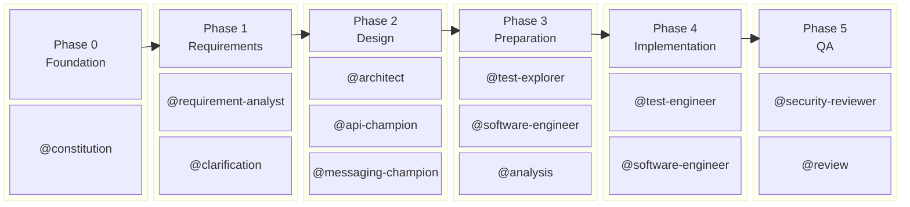

# Enterprise SDD Workflow

> **v4.7** — April 26, 2026

A comprehensive Spec-Driven Development (SDD) workflow for enterprise teams, featuring AI-assisted specification, design, and implementation with quality gates and traceability.

## Overview

Enterprise SDD is built around a simple rule: write and validate the working artifacts before implementation drifts away from the intended behavior. In practice, the workflow revolves around a small loop:

1. Create the project rules and a feature scaffold.
2. Fill the business, specification, design, and test artifacts with the appropriate agents.
3. Validate gates as the artifacts become ready.
4. Implement, review, and ship from the same source of truth.

### What Problems Does It Solve

| Problem | How Enterprise SDD Addresses It |
|---------|-------------------------------|
| Code diverges from requirements | **Traceability chain** from US → AC → TC → Task → Code, verified by Analysis agent |
| Quality is checked too late | **4 quality gates** enforce completeness at each phase boundary |
| Specs are informal and incomplete | **Mandatory templates** with structured fields — agents must fill every section |
| No foundation for agent behavior | **Constitution** establishes non-negotiable project principles before any work begins |
| Manual validation is error-prone | **Python CLI + cross-platform scripts + CI/CD workflows** enforce gates and synchronization programmatically (bash on macOS/Linux, PowerShell on Windows) |
| Team members don't know what's ready | **Status dashboard + CLI reports** expose per-feature health and phase readiness |
| Long-running sessions lose context quality | **Context bridges + structured memory** compress handoffs and preserve decisions across phases |
| Process overhead is too heavy for trivial work | **Adaptive ceremony levels** scale the workflow from ultra-light to full governance |
| Teams are locked into one editor or one model | **Python CLI + multi-IDE adapters + model-tier abstraction** separate workflow logic from IDE/provider specifics |
| Tech-agnostic core lacks stack-specific depth | **User Modules and tailored extensions** inject domain/frontend knowledge without forking the SDD core |

### The Six Phases

The framework operates in a 6-phase pipeline:



### Gate Enforcement Model

```
Phase 0 ─── Phase 1 ─── 🚪 Gate 1 ─── Phase 2 ─── 🚪 Gate 2 ─── Phase 3 ─── 🚪 Gate 3 ─── Phase 4 ─── Phase 5 ─── 🚪 Gate 4
                                                                                                                        (re-checks ALL)
```

Gates 1–3 validate only their own phase. **Gate 4 (Ship Gate)** re-validates everything, allowing parallel work across phases during development while enforcing full compliance before release.

### Key Design Patterns

| Pattern | Description |
|---------|-------------|
| **Constitution-First** | All agents reference `constitution.md` as their governing document — it establishes tech stack, quality standards, and boundaries |
| **Multi-Mode Agents** | `@requirement-analyst` has Vision/Detailed/Teaching modes; `@software-engineer` has Planning/Implementation modes |
| **Template-Driven Output** | Every artifact has a structured template; agents fill templates, scripts detect unfilled templates |
| **Traceability IDs** | Every item has an ID scheme: US-XXX, AC-XXX, NFR-XXX, TC-XXX, TXXX — cross-referenced across all artifacts |
| **Gate Enforcement** | Automated scripts validate artifact completeness and content quality at phase boundaries |
| **Adaptive Ceremony** | Ultra-light, standard, and full modes let the same workflow scale from quick fixes to regulated delivery |
| **Structured Memory + Context Bridges** | Persistent memory files and phase-entry bridge summaries reduce context rot and improve restartability |
| **Portable Command Layer** | A Python CLI, Bash/PowerShell parity, and adapter generation make the framework usable beyond a single editor surface |
| **Layered Extensibility** | Modules, extensions, and presets compose additively: domain knowledge, workflow customization, and operating defaults stay separate |
| **TDD Pipeline** | Phase 4 follows strict Red-Green: `@test-engineer` writes failing tests, `@software-engineer` makes them pass |

The repository exposes three layers:

- VS Code agents, prompts, and instruction files under `.github/`
- Shell and PowerShell automation under `.specify/scripts/`
- A Python CLI under `.specify/cli/` that wraps the core workflow commands

### Read This First

Use this documentation set by intent:

- Start with `PLAYBOOK.md` for the end-to-end operational flow.
- Use `INSTALL-IN-NEW-PROJECT.md` when adopting Enterprise SDD into a brand new or existing application repository.
- Use `MIGRATION-GUIDE.md` when upgrading from a previous version.
- Use `TEAM-ADOPTION-GUIDE.md` for rollout strategy across teams.

### What You Get

- **16 Core AI Agents** for the delivery workflow, plus additional agents via modules (e.g., sdd-evolution) — including a dedicated `@security-reviewer` for OWASP-based security gate
- **28 Prompt Files** for common workflow scenarios, including curated prompts (`challenge`, `plan-implementation`, `assert-quality`, `review-functional`, `review-code`, `test-journey`, `debug-5-whys`, `reproduce-bug`, `autonomous-implement`, `retrospective`, `spike`, `convergence-review`)
- **Shared Instruction Files** for cross-cutting concerns such as traceability, question format, constitution reading, API patterns, messaging patterns, ceremony levels, structured memory, context bridge, stuck detection, cost tracking, anti-patterns, anti-pattern code examples, autonomy policy, TDD enforcement, prompt injection scanning, agent design principles, agent lint checks, progressive planning, escalation protocol, convergence review, gate hooks, instruction authoring governance, and session discipline
- **Curated Skills Layer** with reusable skills under `.github/skills/` (`sdd-auto-implement`, `sdd-challenge`, `sdd-spec-review`, `pattern-analyze`, `sdd-ambiguity-score`, `ingest-docs`, `malicious-code-detection`, `supply-chain-risk`, `secrets-scan`, `sdd-agent-lint`, `sdd-docx-builder`, `sdd-xlsx-builder`, `sdd-pptx-builder`, `red-team-spec`) and local descriptors under `.specify/skills/`
- **4 Quality Gates** ensuring consistency and completeness
- **Structured Memory + Context Bridges** for durable phase-to-phase execution and restartable sessions
- **Automated CI/CD workflows** for gate enforcement
- **MCP Servers** for enhanced context and tool access
- **Full Traceability** from requirements to implementation
- **Python CLI** (`sdd`) for VS Code-free operation — including `sdd init`, `sdd new` (`--progressive`), `sdd gate` (`--hooks`, `--convergence`), `sdd status` (`--autonomy`, `--graph`, `--escalations`), `sdd analyze` (`--gaps`), `sdd report` (`--format md|docx|xlsx|pptx`), `sdd resume`, `sdd bridge`, `sdd adapters generate`, `sdd module`, `sdd preset` (`apply --wrap`, `show --resolved`), `sdd sync`, `sdd spell`, `sdd route`, `sdd ship`, `sdd memory`, `sdd extension`, `sdd skill` (`list|validate|run|validate-mapping`), `sdd autonomy status`, `sdd context compile` (`--section`), `sdd retrospect` (`--extract`), `sdd spike` (`start|wrap`), `sdd ingest`, and `sdd doctor`
- **Multi-IDE Adapters** for VS Code/Copilot, Cursor, Claude Code, Windsurf, and Codex — generated from a single canonical source via `sdd adapters generate`
- **Extension System** with lifecycle hooks in `.sdd-extensions/`
- **Tailored Frontend Extension Specialization** with namespace enforcement (`fe` / `aws-fe`) and conflict diagnostics
- **Workflow Presets** in `.specify/presets/` for API, event-driven, monorepo, and ceremony-driven setups
- **Issue Tracker Sync** for GitHub and GitLab — `sdd sync push/pull` links `tasks.md` to issues
- **User Modules** for stack-specific knowledge injection — currently `core-be`, `std-fe`, `aws-fe`, and `aidd`
- **Security Hardening** with prompt injection scanning (`injection-scan.instructions.md`) applied to all agents via `applyTo: "**/*"`
- **Ambiguity Scoring** via `sdd skill run ambiguity-score` — quantified spec readiness check before Gate 1
- **Spike Mode** for time-boxed feasibility experiments before entering the formal SDD pipeline (`sdd spike start|wrap`)
- **Brownfield Onboarding** with document ingestion (`sdd ingest`) to classify existing docs into SDD artifact slots
- **Agent Size Governance** with size-tier budgets (compact/standard/extended) and lint scripts
- **Instruction Size Governance** with `sdd doctor` warnings when instruction files exceed 50 lines
- **Marker-Based Context Upsert** with `<!-- sdd:section:NAME -->` markers for targeted context-bridge updates
- **Security Pipeline** with dedicated `@security-reviewer` agent, OWASP Top 10 checklist, severity-leveled findings, and Gate 4 security evidence requirement
- **Anti-Sycophantic Behavior** (Rule 7) enforcing challenge-first responses to unvalidated proposals
- **P1/P2/P3 Question Priority Tiers** ensuring critical assumptions are resolved before proceeding
- **Agent Design Principles** — 6 codified principles (Less Is More, Explicit Boundaries, Failure Behavior, Template Discipline, Tool Minimalism, Handoff Clarity)
- **Instruction Compliance Review** mode in `@review` agent comparing branch diffs against applicable `.instructions.md` rules
- **Agent Lint Skill** (`sdd skill run agent-lint`) verifying agent/instruction structural quality
- **Office Document Generation** via `sdd report --format docx|xlsx|pptx` using Python stdlib-only builder skills
- **Project-Specific Prompt Libraries** pattern for codifying recurring ticket patterns
- **Figma MCP Integration** (opt-in) in frontend extension packs for design-to-code workflows
- **Hidden Unicode Scanning** via `sdd doctor --scan-unicode` and `sdd module install` pre-write scan — detects Tag Characters, Bidi Overrides, Zero-Width, Variation Selectors, Invisible Operators, and Deprecated Formatting codepoints
- **SARIF CI Gate Output** via `sdd doctor --format sarif` for GitHub Code Scanning integration, with 6 defined rule IDs and a ready-to-use CI workflow example
- **APM Coexistence** documented directory ownership model for projects using both Enterprise SDD and Microsoft APM side by side

## Quick Start

### Prerequisites

- **VS Code** with GitHub Copilot and GitHub Copilot Chat extensions
- **Python** >= 3.11
- **Git**

### Installation

For installation into a different repository (greenfield or existing app repo), follow:

- [INSTALL-IN-NEW-PROJECT.md](INSTALL-IN-NEW-PROJECT.md)

1. **Clone the repository:**
   ```bash
   # Replace the URL with your fork/organization repository URL
   git clone https://github.com/your-org/enterprise-sdd-workflow.git
   cd enterprise-sdd-workflow
   ```

2. **Initialize the workspace:**
   ```bash
   chmod +x .specify/scripts/*.sh
   ./.specify/scripts/init.sh
   ```

3. **Optional: install the Python CLI in editable mode:**
   ```bash
   pip install -e .specify/cli
   ```

4. **Optional: configure integrations:**
   ```bash
   cp .env.example .env
   pip install -r mcp-servers/requirements.txt
   ```

5. **Open the repository in VS Code and verify that the agents are visible in Copilot Chat.**

## Typical Workflow

### 1. Set Project Rules

Start by creating the constitution that defines how the project should behave:

```
@constitution
```

This creates `.specify/memory/constitution.md` and becomes the baseline for naming, quality, architecture, and model-tier decisions.

### 2. Create a Feature Scaffold

Use one entry point (CLI recommended):

```bash
./.specify/scripts/new-feature.sh "user authentication"
# or
sdd new user-authentication
sdd new user-authentication --template standard --dry-run
```

This creates a numbered folder under `.specify/specs/` with the standard artifacts (`business-context.md`, `spec.md`, `clarifications.md`, `plan.md`, `test-cases.md`, `tasks.md`, `analysis-report.md`, `ship-checklist.md`, and `contracts/`).

For CLI contract compatibility, the scaffold also includes `design.md` and `implementation.md` aliases so downstream tooling can target either naming convention.

### 3. Fill the Core Artifacts

Use the agents in the order that best matches the work, not because the documentation forces a rigid phase sequence:

- `@requirement-analyst` for `business-context.md` and `spec.md`
- `@clarification` for `clarifications.md`
- `@architect` for `plan.md` and optional data-model output
- `@api-champion` or `@messaging-champion` for contract files
- `@test-explorer`, `@gherkin-analyst`, `@software-engineer`, and `@analysis` for tests, tasks, and consistency

### 4. Validate Gates When Artifacts Are Ready

```bash
sdd gate 001-user-auth 1
sdd gate 001-user-auth 2
sdd gate 001-user-auth 3
sdd gate 001-user-auth 4

# shell fallback still works
./.specify/scripts/validate-gate.sh 001-user-auth 1
```

### 5. Implement and Review

Use `@test-engineer` and `@software-engineer` for code and tests, then `@review` to complete `ship-checklist.md`. Use `@refactoring` or `@tech-context-maintainer` when they add value, not as mandatory ceremony.

### 6. Use Optional Workflow Enhancements

- `sdd adapters generate` to generate IDE-specific agent adapters
- `sdd preset apply ...` to apply workflow defaults
- `sdd sync push|pull ...` to sync tasks with issues
- `sdd spell ...` to resolve a prompt by name and prepare feature context for chat execution
- `sdd bridge ...` to generate a context bridge between work sessions
- `sdd extension validate|doctor ...` to validate and diagnose extension manifests
- `sdd skill run ...` to execute curated skills against a feature context
- `sdd skill validate-mapping` to validate command-to-phase and curated prompt/skill alignment

## Tailored Extension Architecture

The extension system uses a two-level schema: a base contract for generic extensions and a tailored specialization for domain-specific workflows (e.g., frontend).

```text
Base contract
(.sdd-extensions/schema/sdd-extension.schema.json)
            |
            v
Tailored specialization
(.sdd-extensions/schema/sdd-tailored-extension.schema.json)
            |
            v
Tailored FE extensions
(.sdd-extensions/extensions/...)
```

Lifecycle commands:

```bash
sdd extension validate .sdd-extensions/extensions/sdd-extension-tailored-dummy-fe --format tailored
sdd extension doctor .sdd-extensions/extensions/sdd-extension-tailored-dummy-fe
./.specify/scripts/extension-resolve-conflicts.sh .sdd-extensions/extensions/sdd-extension-tailored-dummy-fe --dry-run
./.specify/tests/extensions/snapshot-test.sh .sdd-extensions/extensions/sdd-extension-tailored-dummy-fe
```

Authoring rules are documented in `.sdd-extensions/AUTHORING-GUIDE.md`.

## Project Structure

```
enterprise-sdd/
├── .claude/
├── .cursor/
├── .github/
│   ├── agents/                    # Canonical VS Code agent definitions
│   ├── skills/                    # Curated SKILL packs
│   ├── instructions/              # Shared instruction files
│   ├── prompts/                   # Prompt templates for common scenarios
│   └── workflows/                 # CI/CD automation
├── .specify/
│   ├── adapters/                  # Canonical adapter source definitions
│   ├── cli/                       # Python CLI package
│   ├── memory/                    # Constitution, session state, decisions, metrics
│   ├── presets/                   # Built-in preset JSON files
│   ├── schemas/                   # JSON schemas for presets and extensions
│   ├── specs/                     # Per-feature artifacts
│   ├── checkpoints/               # Gate checkpoint files
│   │   └── stuck-history/         # Stuck detection logs
│   ├── skills/                    # Local skill descriptors and index
│   ├── templates/                 # Artifact and setup templates
│   └── scripts/                   # Automation scripts (Bash + PowerShell)
├── .sdd-extensions/              # Optional lifecycle extensions
│   ├── extensions/                # Installed extension packs
│   ├── schema/                    # Generic + tailored extension schemas
│   ├── AUTHORING-GUIDE.md
│   └── README.md
├── .sdd-modules/                 # Optional user modules
├── .vscode/
├── mcp-servers/
├── .env.example
├── PLAYBOOK.md
└── README.md
```

## Command Surfaces

The repository exposes two command entry points:

- **Python CLI `sdd` (primary)**: canonical interface for `init`, `new`, `gate`, `status`, `analyze`, `report`, `resume`, `bridge`, `module`, `adapters`, `preset`, `sync`, `spell`, `route`, `ship`, `memory`, `extension`, and `skill`.
- **Shell scripts in `.specify/scripts/` (low-level)**: implementation scripts for Bash/PowerShell and direct automation.

The shell dispatcher `.specify/scripts/sdd` delegates to Python CLI and keeps compatibility aliases such as `validate -> gate`.

Note on `sdd spell`: it currently resolves prompt/context and prints execution guidance; it does not directly execute prompts through Copilot Chat from the CLI.

### CLI Coherency Matrix (Implementation-Verified)

The following mapping is verified against `.specify/cli/sdd/cli.py` and command handlers under `.specify/cli/sdd/commands/`.

| CLI command | Backend implementation | Type |
|-------------|-------------------------|------|
| `sdd init` | `init.sh` via `commands/init.py` | script wrapper |
| `sdd new` | `new-feature.sh` via `commands/new.py` | script wrapper |
| `sdd gate` | `validate-gate.sh` via `commands/gate.py` | script wrapper |
| `sdd status` | `status.sh` via `commands/status.py` | script wrapper |
| `sdd analyze` | `analyze-consistency.sh` via `commands/analyze.py` | script wrapper |
| `sdd report` | `generate-report.sh` via `commands/report.py` | script wrapper |
| `sdd resume` | `resume-feature.sh` via `commands/resume.py` | script wrapper |
| `sdd bridge` | `context-bridge.sh` via `commands/bridge.py` | script wrapper |
| `sdd module ...` | `module-*.sh` via `commands/module.py` | script wrapper |
| `sdd adapters generate` | `generate-adapters.py` via `commands/adapters.py` | python runner |
| `sdd preset ...` | `.specify/presets/*.json` via `commands/preset.py` | native python |
| `sdd sync ...` | `tasks-to-issues.sh` / `issues-to-tasks.sh` via `commands/sync.py` | script wrapper |
| `sdd spell` | prompt/context resolver via `commands/spell.py` | native python |
| `sdd route` | model routing via `commands/route.py` | native python |
| `sdd ship` | `worktree-ship.sh` via `commands/ship.py` | script wrapper |
| `sdd extension ...` | `extension-validate.sh` / `extension-doctor.sh` via `commands/extension.py` | script wrapper |
| `sdd memory ...` | `memory-status.sh` / `memory-sync.sh` / `memory-doctor.sh` via `commands/memory.py` | script wrapper |
| `sdd skill ...` | `skill-*.sh` / `validate-command-taxonomy.sh` via `commands/skill.py` | script wrapper |
| `sdd autonomy status` | `autonomy-status.sh` via `commands/autonomy.py` | script wrapper |

## Scripts Reference

The repository contains a broad Bash/PowerShell automation suite. The table below highlights the most important entry points rather than listing every helper script.

| Script | Description | Usage |
|--------|-------------|-------|
| `init.sh` | Initialize `.specify/` structure | `./.specify/scripts/init.sh` |
| `new-feature.sh` | Create feature scaffold from templates | `./.specify/scripts/new-feature.sh "feature name"` |
| `validate-gate.sh` | Validate gate criteria | `./.specify/scripts/validate-gate.sh <feature-id> <1\|2\|3\|4>` |
| `analyze-consistency.sh` | Check artifact consistency | `./.specify/scripts/analyze-consistency.sh <feature-id>` |
| `generate-report.sh` | Generate analysis report | `./.specify/scripts/generate-report.sh <feature-id>` |
| `status.sh` | Show feature status dashboard | `./.specify/scripts/status.sh [feature-id]` |
| `context-bridge.sh` | Generate a context bridge between work sessions | `./.specify/scripts/context-bridge.sh <feature-id> [phase]` |
| `module-install.sh` | Install a user module | `./.specify/scripts/module-install.sh <module-name>` |
| `generate-adapters.py` | Generate multi-IDE adapter files | `python3 ./.specify/scripts/generate-adapters.py [--target all\|vscode\|cursor\|claude\|windsurf\|codex]` |
| `skill-run.sh` | Run curated or local skills against feature context | `./.specify/scripts/skill-run.sh <skill-name> <feature-id> [--dry-run]` |
| `validate-command-taxonomy.sh` | Validate command-to-phase mapping and curated prompt/skill alignment | `./.specify/scripts/validate-command-taxonomy.sh` |
| `tasks-to-issues.sh` | Push `tasks.md` to GitHub/GitLab issues | `./.specify/scripts/tasks-to-issues.sh <feature-id>` |
| `issues-to-tasks.sh` | Pull issue states back to `tasks.md` | `./.specify/scripts/issues-to-tasks.sh <feature-id>` |

> **CLI reference:** The Python CLI is documented in [PLAYBOOK.md](PLAYBOOK.md#cli-usage) and should be treated as the primary command interface.

## Available User Modules

For the complete step-by-step module workflow, see [PLAYBOOK.md - User Modules](PLAYBOOK.md#user-modules).

## 🤖 Agent Reference

| Agent | Typical Use | Artifacts | Description |
|-------|-------------|-----------|-------------|
| `@brainstorming` | Discovery | Brainstorm summary (chat) | Early ideation and exploration |
| `@constitution` | Project rules | constitution.md | Establish project principles |
| `@requirement-analyst` | Requirements | business-context.md, spec.md | Capture requirements (Vision / Detailed / Teaching modes) |
| `@clarification` | Requirements refinement | clarifications.md | Resolve ambiguities |
| `@architect` | Design | plan.md, data-model.md | Technical design |
| `@api-champion` | API design | openapi.yaml | REST API contracts |
| `@messaging-champion` | Event design | asyncapi.yaml | Async messaging |
| `@test-explorer` | Test design | test-cases.md | Test strategy |
| `@gherkin-analyst` | BDD | .feature files | BDD/Gherkin scenarios |
| `@software-engineer` | Planning + implementation | tasks.md + source files | Task breakdown (planning mode) and feature implementation (implementation mode) |
| `@analysis` | Consistency | analysis-report.md | Consistency analysis |
| `@test-engineer` | Test implementation | Test files | Test implementation |
| `@review` | Ship readiness | ship-checklist.md | Quality assurance |
| `@refactoring` | Code quality | refactoring-plan.md | Tech debt analysis against constitution |
| `@tech-context-maintainer` | Maintenance | drift-report.md | Spec/code/constitution drift detection |

> **Meta-builder agents** (`@agent-builder`, `@instruction-builder`, `@guidance-builder`, `@prompt-builder`, `@workflow-builder`) are provided by the **sdd-evolution** module. Install it with `sdd module install sdd-evolution`.

## MCP Servers

### Included Servers

| Server | Purpose | Required |
|--------|---------|----------|
| `spec-memory` | Manage specification context | Yes |
| `confluence` | Access internal wiki | Optional |
| `jira` | Access issue tracker | Optional |

### External Servers (via uvx)

| Server | Purpose |
|--------|---------|
| `filesystem` | Local file access |
| `github` | Repository integration |
| `memory` | Persistent memory |
| `fetch` | Web content retrieval |

### Configuration

Edit `.env` with your credentials:

```bash
# Required
GITHUB_TOKEN=ghp_xxx

# Optional - for Confluence
CONFLUENCE_URL=https://your-company.atlassian.net/wiki
CONFLUENCE_API_TOKEN=xxx
CONFLUENCE_USER_EMAIL=you@company.com

# Optional - for Jira
JIRA_URL=https://your-company.atlassian.net
JIRA_API_TOKEN=xxx
JIRA_USER_EMAIL=you@company.com
```

## CI/CD Workflows

### Automatic Triggers

| Workflow | Trigger | Action |
|----------|---------|--------|
| `spec-gate-enforcement` | PR to `.specify/specs/**` or `.specify/memory/**` | Validate gate criteria |
| `consistency-check` | PR to spec artifacts; push to `main` | Check artifact consistency |
| `ship-checklist-validation` | PR to `main` with `ship-checklist.md` | Verify ship readiness |
| `constitution-check` | PR to `.specify/specs/**`; push to `main` for `constitution.md` | Ensure constitution exists |
| `spec-lint` | PR or push to `.specify/**/*.md` | Lint markdown files |

### Manual Triggers

Run from GitHub Actions tab with `workflow_dispatch`:

```bash
# Example: Validate Gate 2 for feature 001-user-auth
gh workflow run spec-gate-enforcement.yml -f feature_id=001-user-auth -f gate=2
```

## Testing the Workflow

### First Test: Create a Sample Feature

1. **Create a new feature:**
   ```bash
   ./.specify/scripts/new-feature.sh "user authentication"
   ```

2. **Check status:**
   ```bash
   ./.specify/scripts/status.sh
   ```

3. **Start with Constitution Agent:**
   Open VS Code chat and type:
   ```
   @constitution establish principles for a NestJS/React application with PostgreSQL
   ```

4. **Begin requirements phase:**
   ```
   @requirement-analyst I need to create a business context for user authentication with email/password and OAuth
   ```

5. **Validate Gate 1:**
   ```bash
   ./.specify/scripts/validate-gate.sh 001-user-authentication 1
   ```

### Verify CI/CD

1. Create a branch and commit spec changes:
   ```bash
   git checkout -b feature/001-user-auth
   git add .specify/
   git commit -m "feat: add user authentication specs"
   git push origin feature/001-user-auth
   ```

2. Create a PR and observe the automated checks.

## Troubleshooting

### Common Issues

| Issue | Solution |
|-------|----------|
| Agent not found | Verify `.github/agents/` directory exists |
| MCP server not starting | Check Python ≥ 3.11, run `pip install -r mcp-servers/requirements.txt` |
| Gate validation fails | Review output, complete missing artifacts |
| Scripts not executable | Run `chmod +x .specify/scripts/*.sh` |
| Extension validation fails | Run `sdd extension validate <path> --format tailored` and fix missing files or schema fields |
| Extension namespace conflict | Run `sdd extension doctor <path>` and ensure prompts/instructions stay in the same namespace (`fe` or `aws-fe`) |

### Debug MCP Servers

```bash
# Test spec-memory server
cd mcp-servers/spec-memory-server
echo '{"jsonrpc": "2.0", "id": 1, "method": "tools/list"}' | python server.py
```

## Additional Resources

- [Playbook](./PLAYBOOK.md) — Step-by-step guide to the complete workflow
- [Install Guide](./INSTALL-IN-NEW-PROJECT.md) — Adopt Enterprise SDD in a new or existing project
- [Migration Guide](./MIGRATION-GUIDE.md) — Upgrade from a previous version
- [Team Adoption Guide](./TEAM-ADOPTION-GUIDE.md) — Rollout strategy across teams

## Development History

The framework evolved through 22 development waves.

## 📄 License

MIT License
